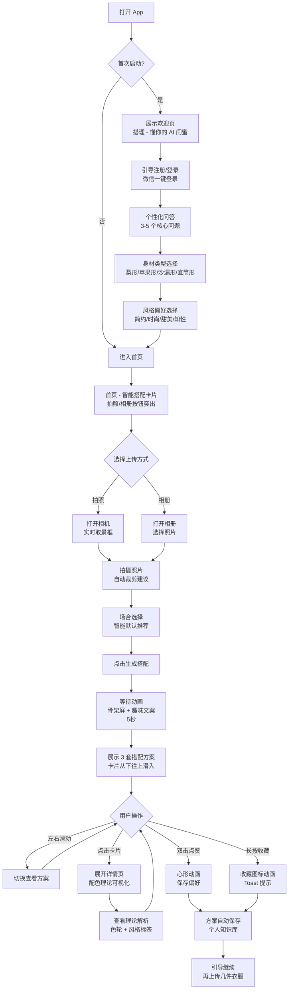
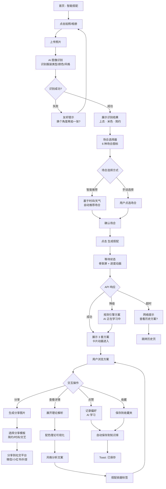
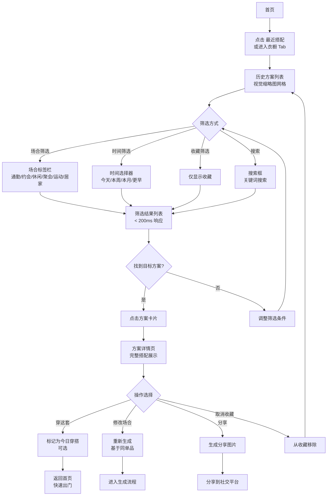
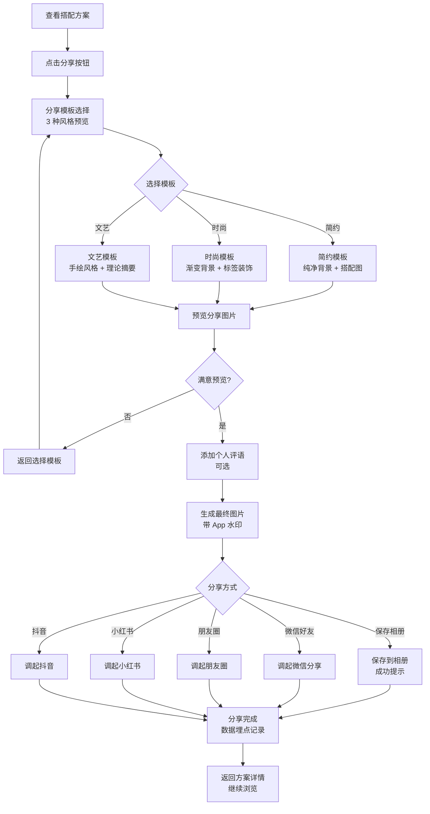
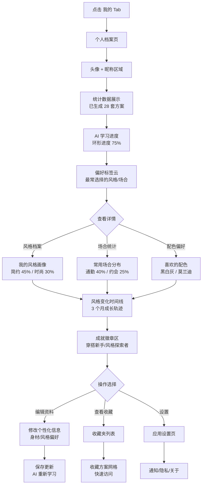

# UX Design Specification - 搭理app

**Author:** Xiaoshaoqian
**Date:** 2025-12-28

---

## Executive Summary

### Project Vision

搭理app 是一款 AI 驱动的个性化穿搭顾问 iOS 应用，旨在解决 18-38 岁中国女性"买了衣服不知道怎么搭配"的核心痛点。产品采用"知识赋能"定位，通过 AI 生成的可视化搭配方案配合专业理论解析（配色原理、风格分析、搭配依据），帮助用户真正理解"为什么这样搭"，从而建立个人穿搭自信和体系。

**核心差异化：**
- **知识赋能 vs. 商品推销**：专注传递搭配知识，而非电商带货
- **渐进式个性化**：注册时引导填写 3-5 个核心问题（身材类型、风格偏好、常见场合），通过点赞/收藏行为持续学习用户偏好
- **个人穿搭知识库**：每次搭配方案自动保存，形成可回顾的学习资源

**产品愿景：**
让每个用户从"不会搭配"成长为"有体系的穿搭自信者"，最终实现"人人都是自己的造型师"。

### Target Users

**主要目标群体：18-38 岁中国女性**

**用户分层：**
- **18-25 岁 Z 世代** (35%)：学生、初入职场，月收入 3K-8K，追求性价比和多样性
- **26-32 岁年轻白领** (45%)：白领、新晋管理层，月收入 8K-20K，注重职业形象和个性表达
- **33-38 岁成熟职场女性** (20%)：中高层管理、专业人士，月收入 15K-40K，追求品质和场合适配

**典型用户画像 - 小雅（30 岁自由职业者）：**
- **背景**：对服装充满热情，每晚浏览购物网站，但购买决策谨慎
- **核心痛点**：
  - 购买前不确定能否搭配现有衣物
  - 购买后不确定搭配是否合适
  - 询问意见时陷入"每个人说法不一"的纠结
- **使用场景**：购买决策辅助、新衣搭配建议、日常出门快速查询、特殊场合（约会、聚会）风格指导
- **成功愿景**：获得专业个性化建议 → 建立穿搭自信 → 从"不会搭配"到"能指导别人"

**心理画像分类（基于市场研究）：**
- **时尚追随者** (35%)：希望"跟上潮流"，期待 AI 告诉"现在流行什么"
- **理性优化者** (30%)：追求"衣橱利用率最大化"，期待"用现有衣服搭出 100 种 look"
- **风格探索者** (20%)：希望"找到属于自己的风格"，期待 AI "根据我的气质推荐"
- **便捷需求者** (15%)：追求效率，期待"每天早上直接告诉我穿什么"

**跨群体共同需求：**
- 被理解的渴望（个性化精准度）
- 降低搭配焦虑（决策支持）
- 提升穿搭自信（心理增益）
- 节省选衣时间（效率提升）

### Key Design Challenges

**UX 设计关键挑战：**

1. **注册流程的摩擦与价值平衡**
   - **挑战**：注册 + 引导填写 3-5 个个性化问题可能增加流失
   - **约束**：30 秒内完成，注册转化率目标 > 60%
   - **设计机会**：通过视觉引导、进度提示、价值预告让用户理解"为什么要填写这些信息"

2. **首次体验的"啊哈时刻"交付**
   - **挑战**：5 秒内生成 3 套搭配方案 + 理论解析，必须让用户感到"这就是我要的"
   - **约束**：首次体验完成率 > 70%，7 天内分享率 > 30%
   - **设计机会**：高清商品图组合 + 精美排版 + 配色理论可视化 + 场合适配建议的多层次价值呈现

3. **AI 个性化的可感知性**
   - **挑战**：如何让用户感知到"AI 越用越懂我"
   - **约束**：用户点赞 10 次后推荐精准度提升 > 15%，但用户看不到算法变化
   - **设计机会**：通过 UI 反馈、个性化标签、推荐理由展示让学习过程可见

4. **场合化推荐的情境化交互**
   - **挑战**：6 种场合（浪漫约会、商务会议、职场通勤等）如何快速选择且不增加认知负担
   - **约束**：移动端屏幕空间有限
   - **设计机会**：图标化场合选择 + 智能默认（基于天气、时间推荐）+ 历史学习

5. **历史方案的可浏览性**
   - **挑战**：用户积累 80+ 套方案后如何高效浏览和查询
   - **约束**：历史方案查询响应 < 200ms（本地 SQLite）
   - **设计机会**：场合分类 + 时间线 + 收藏标记 + 视觉缩略图的多维度组织

6. **离线体验的连续性**
   - **挑战**：AI 生成需要网络，但历史查看支持离线，如何设计状态过渡
   - **约束**：离线状态下展示友好提示，引导用户查看历史方案
   - **设计机会**：智能降级体验 + 离线优先的数据架构设计

### Design Opportunities

**UX 设计创新机会：**

1. **"懂你的闺蜜 AI"情感化设计**
   - **洞察**：82% 用户愿意尝试 AI 工具，但 64% 担心"太机械/没有人情味"
   - **机会**：通过语气设计（友好而非冷冰冰）、动效（自然流畅）、反馈文案（鼓励性）让 AI 像"懂时尚的闺蜜"
   - **参考**：Nike Training Club 的语气、Headspace 的温暖动效

2. **理论解析的可视化创新**
   - **差异化优势**：配色原理可视化（色轮、配色卡片）+ 风格标签卡片 + 场合适配图标
   - **机会**：让抽象的"为什么这样搭"变得直观易懂，用户能够"一眼看懂"搭配逻辑
   - **技术实现**：自定义插画组件 + 动态色彩映射

3. **渐进式个性化学习的可见性**
   - **机会**：通过"你的风格档案"、"AI 学习进度"、"偏好标签云"让用户看到自己的成长轨迹
   - **设计策略**：gamification 元素（如"已生成 28 套方案"、"AI 对你的了解度 75%"）

4. **分享图片的社交传播优化**
   - **目标**：30% 用户主动分享搭配方案到微信/小红书/抖音
   - **机会**：3 种分享图片模板（简约、时尚、文艺）+ app 水印设计 + 一键生成精美排版
   - **设计重点**：分享图片本身就是"值得展示的作品"

5. **等待体验的优雅设计 (Progressive Disclosure)**
   - **约束**：生成式 AI 绘图需要 15-30 秒
   - **机会**：采用渐进式加载策略
     - 第 1-5 秒：展示"搭配策略"文字（如"为您选择了撞色搭配..."），让用户立刻有获得感
     - 第 5-15 秒：展示进度条/骨架屏 + 趣味文案（"AI 正在为您渲染试穿效果..."）
     - 完成：展示最终的高清渲染图
   - **参考**：Midjourney 的生成过程、Gamma 的逐步渲染

6. **iOS 平台特性的深度利用**
   - **机会**：
     - 动态字体（支持系统字体放大，NFR-U13）
     - 刘海屏安全区域的创意利用（沉浸式体验）
     - SF Symbols 图标系统（原生感）
     - Haptic Feedback（触觉反馈增强操作确认）
     - Widget 小组件（增长阶段：今日推荐穿搭）

## Core User Experience

### Defining Experience

搭理app 的核心用户体验围绕一个清晰的价值循环展开：

**核心循环：**
```
拍摄/选择单品 → 确认识别结果 → AI 生成策略 (5s) → 为您绘图 (15s) → 惊喜交付
→ 点赞/收藏反馈 → 后台自动沉淀数据 → 循环开始
```

**核心操作定义：**
- **最频繁操作**：生成搭配方案（核心价值交付点）
- **次频繁操作**：查看历史方案（知识库回顾）
- **关键反馈**：点赞/收藏（AI 个性化学习输入）

用户的核心体验是"拥有一个懂时尚的 AI 闺蜜"，随时可以：
- 拍照问："这件衣服怎么搭？"
- 早上问："今天穿什么去上班？"
- 购物前问："这件能和我现有的衣服搭吗？"

每次交互都不仅给出"搭配方案"，更重要的是告诉用户"为什么这样搭"，帮助用户建立穿搭知识体系。

### Platform Strategy

**平台定位：iOS 移动应用（MVP 阶段）**

**交互模式：**
- **主要交互**：触摸为主（点击、滑动、长按）
- **输入方式**：相机拍照、相册选择、场合选择、点赞/收藏
- **输出方式**：视觉化搭配方案 + 图文理论解析

**平台能力需求：**
1. **相机/相册** - 核心功能，拍摄/选择单品照片
2. **本地存储（SQLite）** - 历史方案完全离线可用，查询响应 < 200ms
3. **位置服务（可选）** - 获取天气信息用于场合智能推荐
4. **推送通知** - 增长阶段用于每日穿搭提醒

**离线体验策略：**
- **必须在线**：AI 生成新搭配方案（调用第三方 API）
- **完全离线**：查看历史方案、浏览个人知识库、场合筛选
- **智能降级**：离线时展示友好提示，引导用户查看历史方案

**技术栈：React Native (Expo)** - 支持未来快速扩展到 Android

### Effortless Interactions

**5 个零摩擦交互区域：**

1. **拍照流程零摩擦**
   - 启动即拍照，无需多步导航
   - 智能裁剪和背景去除，用户无需手动调整
   - 支持相册批量选择，一次生成多套方案

2. **场合选择智能化**
   - 基于时间（工作日 → 职场通勤，周末 → 休闲娱乐）
   - 基于天气（下雨 → 建议带伞搭配，寒冷 → 保暖搭配）
   - 基于历史（用户常选场合优先展示）
   - 默认推荐，用户可一键确认或快速调整

3. **历史查询即时化**
   - 自动分类（按场合、按时间、按收藏）
   - 收藏方案优先展示
   - 视觉缩略图网格布局，一屏浏览更多
   - 本地 SQLite 查询 < 200ms 响应

4. **分享一键完成**
   - 自动生成精美分享图片（3 种模板可选）
   - app 水印设计（品牌传播）
   - 一键保存到相册或分享到微信/小红书/抖音
   - 分享图片本身就是"值得展示的作品"

5. **权限请求延迟化**
   - 相机权限：首次拍照时才请求
   - 位置权限：首次使用天气场合推荐时才请求
   - 推送权限：增长阶段首次启用每日提醒时才请求
   - 避免首次启动即弹出多个权限请求

### Critical Success Moments

**4 个关键成功时刻：**

1. **首次生成的"啊哈时刻"（5 秒内）**
   - **时机**：用户首次拍照上传单品，AI 生成搭配方案
   - **设计要求**：
     - 5 秒内返回 3 套高质量搭配方案
     - 高清商品图组合 + 精美排版
     - 配色理论可视化（色轮、配色卡片）
     - 场合适配建议 + 风格标签
   - **成功标准**：用户感到"这就是我要的"，首次体验完成率 > 70%
   - **如果失败**：用户会立即卸载或放弃使用

2. **注册完成的"价值预见"（30 秒内）**
   - **时机**：用户完成注册 + 3-5 个个性化问题填写
   - **设计要求**：
     - 总时长控制在 30 秒内
     - 视觉引导 + 进度提示
     - 价值预告（"AI 正在为你定制专属风格档案..."）
   - **成功标准**：注册转化率 > 60%
   - **如果失败**：用户流失，无法体验核心功能

3. **首次分享的"社交认同"（7 天内）**
   - **时机**：用户对某套搭配方案特别满意，主动分享到社交平台
   - **设计要求**：
     - 分享图片设计精美，值得展示
     - app 水印设计（品牌传播）
     - 一键分享流程流畅
   - **成功标准**：7 天内分享率 > 30%
   - **如果失败**：失去口碑传播和自然增长机会

4. **历史回顾的"成长可见"（10+ 套方案后）**
   - **时机**：用户积累 10+ 套搭配方案后，查看历史统计
   - **设计要求**：
     - 统计可视化（"已生成 28 套方案"、"AI 对你的了解度 75%"）
     - 偏好标签云（用户最常选择的风格、场合、配色）
     - "你的风格档案"展示个人成长轨迹
   - **成功标准**：用户感到"我真的在成长"，建立长期使用习惯
   - **如果失败**：用户感知不到价值积累，使用频次下降

### Experience Principles

**5 条核心体验原则（指导所有 UX 设计决策）：**

1. **"5 秒啊哈"原则**
   - **定义**：首次生成搭配方案必须在 5 秒内让用户感到"这就是我要的"
   - **实施要求**：
     - API 响应时间优化至 < 5 秒
     - 等待体验设计：骨架屏 + 进度动画 + 趣味文案
     - 结果呈现：高质量视觉 + 多层次价值（搭配 + 理论）
   - **应用场景**：首次体验、每次生成方案的等待与呈现

2. **"零摩擦交互"原则**
   - **定义**：核心流程必须在 < 3 步内完成，无需多余操作
   - **实施要求**：
     - 拍照 → 场合选择（智能默认）→ 生成方案（共 2 步）
     - 历史查询：首页直接展示，无需导航
     - 分享：一键生成图片，一键分享
   - **应用场景**：所有高频操作流程设计

3. **"懂你的 AI 闺蜜"原则**
   - **定义**：AI 交互必须像"懂时尚的闺蜜"而非"冷冰冰的算法"
   - **实施要求**：
     - 语气设计：友好、鼓励性（"这套搭配很适合你的气质！"）
     - 动效设计：自然流畅，有温度感
     - 个性化可见：展示推荐理由（"根据你对简约风的偏好..."）
   - **应用场景**：所有文案、动效、反馈设计
   - **参考**：Nike Training Club 的语气、Headspace 的温暖动效

4. **"知识沉淀可见"原则**
   - **定义**：让用户看到自己的成长轨迹和知识积累
   - **实施要求**：
     - 统计可视化（已生成方案数、AI 学习进度）
     - 偏好标签云（最常选择的风格、场合）
     - "你的风格档案"功能
     - Gamification 元素（成就感设计）
   - **应用场景**：历史方案管理、个人档案页

5. **"离线优先，智能降级"原则**
   - **定义**：历史方案完全离线可用，网络不可用时提供友好降级体验
   - **实施要求**：
     - SQLite 本地存储，查询响应 < 200ms
     - 离线状态明确提示，引导查看历史
     - 网络恢复后自动同步
   - **应用场景**：数据架构设计、网络状态处理

## Desired Emotional Response

### Primary Emotional Goals

**核心情感：被理解 + 被赋能 + 惊喜**

搭理app 的首要情感目标是让用户从"不会搭配的焦虑"转变为"我懂了的自信"，核心情感体验包括：

1. **被深度理解感** - "AI 真的懂我的身材/风格/需求"
2. **知识赋能感** - "我不仅知道怎么搭，还知道为什么这样搭"
3. **持续惊喜感** - "每次都能给我新的启发"

**情感差异化定位：**
- vs. 小红书/抖音："被启发"而非"被淹没"
- vs. 蘑菇街："被赋能"而非"被推销"
- vs. 搭搭："被理解"而非"被机械推荐"

### Emotional Journey Mapping

| 用户旅程阶段 | 期望情感状态 | 情感设计目标 | 避免的负面情感 |
|------------|------------|------------|--------------|
| **首次发现** | 共鸣 + 好奇 | "终于有人懂我的困扰" | 怀疑、不信任 |
| **注册引导** | 期待 + 被重视 | "这个 app 真的在乎我的需求" | 不耐烦、被打扰 |
| **首次生成** | 惊喜 + 认同 | "哇，这就是我要的！" | 失望、质疑 |
| **查看理论解析** | 启发 + 自信 | "我懂了，原来是这样" | 困惑、信息过载 |
| **点赞收藏** | 满足 + 掌控感 | "我在主动塑造 AI" | 被动、无意义操作 |
| **历史回顾** | 成就 + 成长 | "我真的进步了" | 平淡、无感 |
| **遇到错误** | 理解 + 宽容 | "AI 在努力理解我" | 挫败、愤怒 |
| **再次使用** | 熟悉 + 惊喜 | "AI 越来越懂我了" | 厌倦、重复感 |

### Micro-Emotions

**3 组核心微情感对立：**

1. **信任 vs. 怀疑**
   - **期望状态**："AI 真的懂我"
   - **设计支持**：展示推荐理由、个性化标签可见、学习进度可视化
   - **避免状态**："这推荐靠谱吗？"
   - **风险场景**：首次生成、推荐不准确时

2. **自信 vs. 焦虑**
   - **期望状态**："我知道怎么穿了"
   - **设计支持**：理论解析可视化、知识沉淀可见、成长轨迹展示
   - **避免状态**："还是不确定"
   - **风险场景**：购买决策前、重要场合穿搭

3. **惊喜 vs. 满意**
   - **期望状态**："哇，没想到还可以这样搭"
   - **设计支持**：多样化方案、创意搭配突破、场合化推荐
   - **避免状态**："嗯，还行"（平淡无感）
   - **风险场景**：长期使用后、方案同质化时

**次级微情感：**
- **成就感 vs. 依赖感** - "我学会了" vs "只能靠 AI"（通过知识解析避免纯依赖）
- **归属感 vs. 孤独感** - "我的专属 AI 闺蜜" vs "又一个冷冰冰的工具"（通过情感化语气设计）

### Design Implications

**情感 → UX 设计映射：**

1. **"被理解感"设计实施**
   - ✅ 注册时 3-5 个个性化问题（身材/风格/场合）
   - ✅ 推荐理由可见化："根据你对简约风的偏好..."
   - ✅ AI 学习进度展示："AI 对你的了解度 75%"
   - ✅ 偏好标签云可视化

2. **"赋能感"设计实施**
   - ✅ 配色理论可视化（色轮、配色卡片）
   - ✅ 风格分析文案："这是邻家风格，适合日常休闲场合"
   - ✅ 搭配依据展示："上浅下深拉长腿部线条"
   - ✅ 个人穿搭知识库积累

3. **"惊喜感"设计实施**
   - ✅ 3 套多样化方案（保守/创意/折中）
   - ✅ 场合化智能推荐（基于天气/时间）
   - ✅ 精美视觉呈现（高清图 + 排版设计）
   - ✅ 首次体验 5 秒啊哈时刻

4. **"信任感"设计实施**
   - ✅ 透明化推荐逻辑展示
   - ✅ 友好错误处理："AI 正在学习你的风格，多点几次赞会更准确哦"
   - ✅ 渐进式个性化：使用越多越精准
   - ✅ 非商业化定位（知识赋能 vs. 卖货）

5. **"自信感"设计实施**
   - ✅ 理论解析帮助理解"为什么"
   - ✅ 历史统计展示成长："已生成 28 套方案"
   - ✅ Gamification 成就系统
   - ✅ 分享功能强化社交认同

### Emotional Design Principles

**5 条情感设计指导原则：**

1. **"温度感优先"原则**
   - 所有文案必须友好、鼓励性，避免机械化表达
   - 参考："这套搭配很适合你的气质！" vs "推荐方案 1"

2. **"透明可解释"原则**
   - 所有 AI 推荐必须展示理由，建立信任
   - 参考："根据你对简约风的偏好..." vs 直接推荐无解释

3. **"成长可见"原则**
   - 用户进步和 AI 学习必须可视化，强化成就感
   - 参考：统计数据、学习进度、偏好标签云

4. **"惊喜与熟悉并存"原则**
   - 既要有熟悉感（AI 懂我），又要有惊喜（新启发）
   - 参考：3 套方案中既有符合偏好的，也有创意突破的

5. **"赋能不依赖"原则**
   - 提供知识解析，让用户"学会"而非"依赖"
   - 参考：配色理论、风格分析、搭配依据的教育性内容

## UX Pattern Analysis & Inspiration

### Inspiring Products Analysis

基于搭理app 的目标用户（18-38 岁中国女性）和产品定位（AI 穿搭决策助手），我们重点分析 3 个最具启发价值的产品：

#### 1. Nike Training Club - 个性化方案生成与成长激励

**核心 UX 优势：**

**问题解决优雅性：**
- 解决"不知道怎么训练"的焦虑 → 类比搭理app 解决"不知道怎么搭配"
- 个性化训练计划生成（基于健身目标/水平/时间）→ 类比个性化搭配方案生成（基于身材/风格/场合）

**友好鼓励性语气设计：**
- ✅ 可转移："这套动作很适合你！继续加油！" → "这套搭配很适合你的气质！"
- ✅ 可转移：训练过程中的即时鼓励 → AI 生成过程中的趣味文案（"AI 正在为你挑选最佳搭配..."）
- ✅ 可转移：完成后的成就反馈 → 搭配方案收藏后的正向反馈

**成长可视化系统：**
- ✅ 训练天数统计、徽章系统 → 可转移为"已生成方案数"、"风格探索徽章"
- ✅ 个人进度追踪 → 可转移为"AI 学习进度 75%"、"偏好标签云"
- ✅ "你的成长故事"时间线 → 可转移为"你的穿搭成长轨迹"

**导航与信息层级：**
- Tab 导航：首页（今日推荐）/ 训练计划 / 我的
- 可转移 → 首页（生成搭配）/ 历史方案 / 个人档案

**错误处理：**
- 网络断开时友好提示："离线状态，查看已下载的训练"
- 可转移 → "离线状态，查看历史搭配方案"

#### 2. 小红书 - 视觉化内容与社交互动

**核心 UX 优势：**

**视觉化内容呈现：**
- ✅ 瀑布流网格布局，高清图片优先 → 可转移为历史方案的视觉缩略图网格
- ✅ 图片 + 标签体系（风格标签、品牌标签）→ 可转移为搭配方案的风格标签（简约/时尚/文艺）+ 场合标签（职场/约会/休闲）
- ✅ 点击图片即进入详情页 → 点击方案即查看详细理论解析

**收藏/点赞交互模式：**
- ✅ 双击点赞、长按收藏 → 可直接转移到搭理app
- ✅ 收藏夹分类管理 → 可转移为场合分类、风格分类
- ⚠️ 但小红书问题：收藏后难以查找 → 搭理app 要解决：本地 SQLite < 200ms 查询

**信息层级与导航：**
- 首页 feed 流 + 搜索 + 我的 → 简洁 Tab 导航
- ✅ 可转移基本结构，但搭理app 简化为：生成 / 历史 / 我的

**⚠️ 反面教材 - 需要避免的问题：**
- ❌ 信息过载：无尽滚动导致用户迷失 → 搭理app：有限方案数（3 套），明确选择
- ❌ 过度商业化：KOL 带货、广告泛滥 → 搭理app：坚持"知识赋能"定位，不做电商
- ❌ 内容同质化：推荐算法导致"茧房效应"→ 搭理app：3 套方案中包含创意突破

#### 3. 美图秀秀/Facetune - 首次体验啊哈时刻与分享优化

**核心 UX 优势：**

**首次体验"啊哈时刻"设计：**
- ✅ 打开 app 即可上传照片，低摩擦体验 → 搭理app：注册后立即引导首次生成
- ✅ AI 美颜效果即时预览（< 2 秒）→ 搭理app：5 秒生成方案
- ✅ 前后对比展示 → 可转移：搭配方案的"推荐理由"展示（为什么这样搭）

**等待体验优化：**
- ✅ 骨架屏 + 进度动画 → 可直接转移到搭理app 的 AI 生成等待
- ✅ 趣味文案："正在为你定制专属美颜..."→ 可转移："AI 正在为你挑选最佳搭配..."
- ✅ 等待时长可预期（进度条 0% → 100%）→ 搭理app：5 秒倒计时或进度条

**一键分享精美图片：**
- ✅ 自动生成精美排版的分享图片 → 搭理app：3 种分享模板（简约/时尚/文艺）
- ✅ app 水印设计（品牌传播）→ 可直接转移
- ✅ 一键保存到相册 / 分享到社交平台 → 可直接转移（微信/小红书/抖音）
- ✅ 分享图片本身就是"值得展示的作品"→ 搭理app 核心目标之一（7 天内分享率 > 30%）

**视觉设计支持情感响应：**
- 界面清爽、功能图标直观 → 搭理app：iOS 原生感设计（SF Symbols）
- 操作反馈及时（Haptic Feedback）→ 搭理app：触觉反馈增强确认

### Transferable UX Patterns

**导航模式：**
- ✅ **简洁 Tab 导航**（3-4 个主 Tab）
  - 搭理app 采用：生成搭配 / 历史方案 / 个人档案
  - 参考：Nike Training Club 的清晰导航结构

**交互模式：**
- ✅ **双击点赞 + 长按收藏**（小红书模式）
- ✅ **滑动查看多个方案**（卡片式滑动切换 3 套方案）
- ✅ **骨架屏 + 进度动画等待体验**（美图秀秀模式）
- ✅ **一键分享流程**（美图秀秀模式）

**视觉模式：**
- ✅ **瀑布流网格布局**（历史方案展示，借鉴小红书）
- ✅ **高清图片 + 标签体系**（风格标签、场合标签）
- ✅ **清爽界面 + 原生图标**（iOS 设计规范）

**情感化设计模式：**
- ✅ **友好鼓励性语气**（Nike Training Club 文案风格）
- ✅ **成长可视化系统**（统计数据、徽章、时间线）
- ✅ **推荐理由展示**（透明可解释原则）

### Anti-Patterns to Avoid

**来自小红书的教训：**
- ❌ **信息过载** - 无尽滚动导致用户迷失 → 搭理app：有限选择（3 套方案），明确决策
- ❌ **过度商业化** - 广告泛滥、KOL 带货 → 搭理app：坚持知识赋能定位，非电商导向
- ❌ **内容同质化** - 算法茧房效应 → 搭理app：方案多样化（保守/创意/折中）
- ❌ **收藏后难查找** - 缺乏高效查询机制 → 搭理app：SQLite < 200ms 查询，多维度筛选

**来自竞品搭搭的教训（基于市场研究）：**
- ❌ **AI 推荐太机械** - 用户反馈"不够时尚/不准确"
  - 搭理app 应对：展示推荐理由、配色理论可视化、风格解析
- ❌ **功能复杂难用** - 学习成本高
  - 搭理app 应对："零摩擦交互"原则，< 3 步完成核心流程
- ❌ **缺乏情感化设计** - 冷冰冰的工具感
  - 搭理app 应对："懂你的 AI 闺蜜"原则，友好语气 + 温暖动效

**通用反面模式：**
- ❌ **首次启动多个权限弹窗** → 搭理app：延迟化权限请求
- ❌ **注册流程冗长** → 搭理app：30 秒内完成，3-5 个核心问题
- ❌ **离线体验断崖式下降** → 搭理app：离线优先，历史完全可用
- ❌ **推荐逻辑不透明** → 搭理app：展示推荐理由，建立信任

### Design Inspiration Strategy

**直接采用（Adopt）：**
1. **Tab 导航结构** - 生成 / 历史 / 我的（借鉴 Nike Training Club + 小红书）
2. **双击点赞 + 长按收藏**（小红书交互模式）
3. **骨架屏 + 进度动画等待体验**（美图秀秀模式）
4. **一键分享精美图片流程**（美图秀秀模式）
5. **友好鼓励性文案语气**（Nike Training Club 风格）

**改编采用（Adapt）：**
1. **成长可视化系统**（Nike Training Club）
   - 改编为：穿搭领域的"已生成方案数"、"风格探索徽章"、"AI 学习进度 75%"
2. **瀑布流网格布局**（小红书）
   - 简化为：历史方案的视觉缩略图网格，支持场合/时间/收藏筛选
3. **标签体系**（小红书）
   - 改编为：风格标签（简约/时尚/文艺）+ 场合标签（职场/约会/休闲/聚会/运动/居家）

**明确避免（Avoid）：**
1. **信息过载设计**（小红书无尽滚动）→ 有限选择（3 套方案），明确决策
2. **过度商业化**（小红书广告、蘑菇街卖货）→ 知识赋能定位，非电商导向
3. **机械化推荐**（搭搭问题）→ 透明可解释，理论可视化，友好语气
4. **复杂功能堆砌**（工具类产品通病）→ 零摩擦交互，核心流程 < 3 步

## Design System Foundation

### Design System Choice

**选择方案：iOS 原生设计规范（Human Interface Guidelines）+ 定制组件库**

搭理app 将基于 iOS 原生设计规范构建，使用 React Native 原生组件为基础，针对核心功能开发 7 个定制组件以实现差异化体验。

### Rationale for Selection

**选择理由：**

1. **完美匹配平台策略**
   - MVP 阶段专注 iOS，原生感设计是最优选择
   - iOS 用户对原生交互模式熟悉度高，零学习成本
   - SF Symbols 图标系统（2000+ 免费图标）完全满足需求
   - React Native 提供良好的 iOS 原生组件映射

2. **符合情感设计目标**
   - iOS 设计语言本身传递"简洁、友好、易用"
   - 支持"温度感优先"原则（iOS 动效、Haptic Feedback）
   - 清爽界面风格与"懂你的 AI 闺蜜"定位天然契合

3. **技术实施可行性高**
   - Expo 提供完整的 iOS API 支持（相机、相册、本地存储、推送）
   - 可使用 `@expo/vector-icons` 集成 SF Symbols
   - 社区生态成熟，问题解决效率高

4. **差异化通过定制组件实现**
   - 配色理论可视化（色轮、配色卡片）- 自定义视觉组件
   - 风格标签系统 - 品牌化设计语言
   - 搭配方案卡片 - 高度定制化展示
   - 成长可视化 - 独特的 gamification 元素

5. **避免过度工程**
   - 不引入额外设计系统学习成本（如 Material Design、Ant Design）
   - 开发团队可快速上手 iOS 原生组件
   - 符合"零摩擦交互"原则，专注核心体验

### Implementation Approach

**基础设计 Token 系统：**

**颜色系统：**
```
主色调：温暖友好色系
- Primary: #FF9AA2 (柔和粉色，传递"懂你的闺蜜"温暖感)
- Secondary: #FFB7B2 (珊瑚色，活力与亲和力)
- Accent: iOS 系统蓝 #007AFF (链接、操作按钮)

中性色：iOS 系统灰阶
- Gray 1: #1C1C1E (深色文本)
- Gray 2: #3A3A3C (次要文本)
- Gray 3: #48484A (边框)
- Gray 4: #F2F2F7 (背景)

语义色：iOS 标准
- Success: #34C759 (成功绿)
- Warning: #FF9500 (警告橙)
- Error: #FF3B30 (错误红)
```

**排版系统：**
```
系统字体：SF Pro (iOS 原生)
- 支持动态字体大小（Dynamic Type，满足 NFR-U13 无障碍需求）

字体层级：
- Large Title: 34pt, Bold (页面标题)
- Title 1: 28pt, Regular (区块标题)
- Title 2: 22pt, Regular (卡片标题)
- Headline: 17pt, Semibold (列表标题)
- Body: 17pt, Regular (正文)
- Callout: 16pt, Regular (次要说明)
- Caption: 12pt, Regular (标签、提示)
```

**间距系统（8px 基础单位）：**
```
- XS: 4px (图标与文字间距)
- S: 8px (组件内间距)
- M: 16px (组件间间距)
- L: 24px (区块间间距)
- XL: 32px (页面边距)
- XXL: 40px (大区块间距)
```

**圆角系统：**
```
- Buttons: 12px (触摸友好)
- Cards: 16px (卡片边缘)
- Images: 8px (图片圆角)
- Chips/Tags: 16px (完全圆角，pill 形状)
```

**阴影系统（iOS 风格轻量阴影）：**
```
- Light: 0 1px 3px rgba(0,0,0,0.08)
- Medium: 0 2px 8px rgba(0,0,0,0.12)
- Heavy: 0 4px 16px rgba(0,0,0,0.16)
```

**React Native 原生组件使用策略：**
- `TabNavigator` - 底部导航（生成 / 历史 / 我的）
- `ScrollView` / `FlatList` - 列表滚动
- `Image` - 图片展示（支持缓存）
- `Text` - 文本（支持动态字体）
- `TouchableOpacity` - 按钮交互
- `Modal` - 弹窗（场合选择、权限请求）
- `Switch` - 开关（设置项）
- `ActivityIndicator` - 加载指示器

### Customization Strategy

**7 个核心定制组件：**

1. **OutfitCard - 搭配方案展示卡片**
   - **功能**：展示单套搭配方案（3 个单品组合图 + 风格标签 + 场合标签）
   - **交互**：双击点赞、长按收藏、点击查看详情
   - **视觉**：高清图片网格 + 渐变背景 + 标签芯片
   - **技术实现**：React Native `View` + `Image` + 自定义动画

2. **TheoryVisualization - 配色理论可视化组件**
   - **功能**：展示配色原理（色轮、互补色、对比色）
   - **视觉**：SVG 色轮 + 配色卡片 + 理论文案
   - **技术实现**：`react-native-svg` + 自定义绘制逻辑

3. **StyleTagChip - 风格标签芯片**
   - **功能**：展示风格分类（简约/时尚/文艺）和场合分类（职场/约会/休闲）
   - **视觉**：pill 形状、品牌色渐变、图标 + 文字
   - **交互**：可选择（多选）、有选中状态
   - **技术实现**：React Native `TouchableOpacity` + 自定义样式

4. **ProgressCircle - AI 学习进度圆形图**
   - **功能**：可视化展示"AI 对你的了解度 75%"
   - **视觉**：环形进度条 + 中心百分比数字 + 动画
   - **技术实现**：`react-native-svg` 环形 Path + 动画库 `react-native-reanimated`

5. **PreferenceCloud - 偏好标签云**
   - **功能**：展示用户最常选择的风格、场合、配色（词云形式）
   - **视觉**：大小不一的标签、热力颜色映射
   - **技术实现**：自定义布局算法 + `Animated` API

6. **ShareTemplate - 分享图片生成器**
   - **功能**：自动生成 3 种风格的分享图片（简约/时尚/文艺）
   - **视觉**：搭配方案 + app 水印 + 精美排版
   - **技术实现**：`react-native-view-shot` 截图 + 模板布局组件

7. **SkeletonLoader - 骨架屏加载组件**
   - **功能**：AI 生成方案时的优雅等待体验（5 秒）
   - **视觉**：搭配卡片骨架 + 脉冲动画 + 趣味文案
   - **技术实现**：`react-native-shimmer-placeholder` + 自定义布局

**第三方库依赖（最小化原则）：**
- `@expo/vector-icons` - SF Symbols 图标
- `react-native-svg` - SVG 绘制（色轮、图表）
- `react-native-reanimated` - 流畅动画
- `react-native-view-shot` - 分享图片生成
- `react-native-shimmer-placeholder` - 骨架屏动画
- `react-native-chart-kit` - 统计图表（成长可视化）

**品牌差异化策略：**
- 主色调（温暖粉色系）区别于竞品（小红书红、搭搭蓝）
- 友好鼓励性语气文案贯穿所有交互
- 配色理论可视化成为视觉记忆点
- "懂你的 AI 闺蜜"情感化设计语言

## Visual Design Foundation

### Core Interaction Definition

**搭理app 的定义性体验：**

"拍摄单品照片 → 5秒内获得个性化搭配方案 + 专业理论解析"

这是用户会向朋友描述的核心动作："你只要拍张衣服照片，AI 马上给你 3 套搭配，还告诉你为什么这样搭！"

**核心体验的两个关键时刻：**

1. **"眼前一亮"（视觉冲击）**：看到搭配方案瞬间的惊喜感
   - 高清商品图 + 精致排版 + 风格/场合标签
   - 出乎意料但合理的搭配组合
   - 能立刻想象"我穿上这套的样子"

2. **"恍然大悟"（理论赋能）**：理解搭配依据后的顿悟感
   - 配色原理可视化（色轮、配色卡片）
   - 通俗易懂的理论解析（"闺蜜的解释"而非学术论文）
   - 可记忆、可复用的搭配知识

### User Mental Model

**用户当前的问题解决方式：**
- 在小红书/抖音搜索类似单品的搭配（耗时、信息过载）
- 询问身边人意见（意见不统一、缺乏专业依据）
- 多次试穿自己尝试（缺乏自信、效率低下）

**用户的核心期望：**
- **速度期望**："马上"知道怎么搭（像问一个随时在线的闺蜜）
- **可信度期望**：建议"有依据"（不是随便推荐）
- **个性化期望**："适合我"（而非泛泛的通用建议）

**潜在困惑和受挫点：**
- 如果 AI 方案看起来"不像我的风格"（个性化不足）
- 如果理论解析太学术/看不懂（表达不够友好）
- 如果推荐的搭配单品"我都没有"（实用性差）

**避免的失败场景：**
- ❌ 搭配看起来"乱搭"，没有美学依据
- ❌ 理论解析太空洞（"这样搭很好看"没说为什么）
- ❌ 推荐太保守或太激进（脱离用户风格定位）

### Core Experience Success Criteria

**"眼前一亮"时刻的成功标准：**
- 视觉呈现精美、专业（高清商品图 + 精致排版）
- 搭配出乎意料但又合理（有惊喜但不离谱）
- 用户能立刻想象"我穿上这套的样子"
- 3 套方案风格多样（保守/创意/折中）

**"恍然大悟"时刻的成功标准：**
- 理论通俗易懂（"闺蜜的解释"而非学术用语）
- 有明确依据（配色原理、风格分析、搭配逻辑）
- 用户能记住并复用这个知识
- 理论可视化（色轮、标签卡片）而非纯文字

**整体体验成功标准：**
- 首次体验完成率 > 70%
- 用户停留时长 > 2 分钟（仔细查看方案和理论）
- 7 天内分享率 > 30%（达成啊哈时刻）
- 用户反馈"有依据"、"学到知识"的比例 > 80%

### UX Pattern Innovation Strategy

**采用成熟模式（降低学习成本）：**
- ✅ 拍照上传：用户熟悉的交互（美图秀秀、淘宝拍照搜索）
- ✅ 卡片滑动：借鉴 Tinder、小红书的成熟手势
- ✅ 点赞/收藏：社交平台的标准交互
- ✅ Tab 导航：iOS 原生导航模式（生成/历史/我的）

**创新组合（差异化优势）：**
- 🆕 **理论可视化呈现**：配色轮盘、风格标签卡片（教育性 + 视觉化）
  - 市场空白：其他 app 要么只给图片，要么只给文字，很少"理论可视化"
- 🆕 **双重价值交付**："眼前一亮"（视觉）+ "恍然大悟"（理论）
  - 搭理app 的独特定位：不只给方案，更教知识
- 🆕 **等待体验设计**：骨架屏 + 趣味文案轮播 + 逐步加载
  - 让 5 秒等待不焦虑，甚至有期待感

**用户教育策略：**
- 使用熟悉的隐喻："像有个懂时尚的闺蜜随时帮你"
- 渐进式学习：首次使用重点"眼前一亮"，多次使用后自然关注理论
- 视觉优先：理论通过图示（色轮、标签）而非长文

### Core Interaction Mechanics

#### 1. 启动阶段（Initiation）

**触发点设计：**
- 打开 app → 首屏大号"拍照"按钮（视觉焦点，iOS 设计规范）
- 底部 Tab 导航："生成搭配"（始终可见）
- 或"从相册选择"（次要入口）

**邀请机制：**
- 文案："拍下你的衣服，让 AI 帮你搭配"
- 空状态插画：展示"拍照 → 搭配"的简单流程
- 首次使用：轻量引导动画（1-2 秒，不打扰）

#### 2. 交互阶段（Interaction）

**用户操作流程：**
1. **拍照**或**选择照片**
   - 照片自动裁剪/背景去除（可选，提升识别准确度）
2. **选择场合**（浪漫约会、职场通勤、休闲娱乐等）
   - 智能默认建议（基于时间、天气、历史偏好）
   - 用户可快速调整（图标化场合选择）
3. **点击"生成搭配"**按钮

**系统响应设计：**
- **即时反馈**：按钮变化（加载动画 + Haptic 反馈）
- **等待体验**（5 秒 AI 生成）：
  - 骨架屏展示 3 个方案卡片轮廓
  - 进度动画（0% → 100%）或进度条
  - 趣味文案轮播：
    - "AI 正在为你挑选最佳搭配..."
    - "分析配色原理中..."
    - "匹配你的风格偏好..."
- **逐步加载**：第一套方案生成后立即显示（不等全部完成，降低感知等待）

#### 3. 反馈阶段（Feedback）

**成功信号设计：**

**"眼前一亮"视觉呈现：**
- 3 套搭配方案卡片从下往上滑入（流畅动画，iOS 原生感）
- 高清商品图组合 + 精美排版（渐变背景、阴影、间距）
- 风格标签（简约风、时尚感）+ 场合标签（职场通勤）
- 卡片可左右滑动切换查看

**"恍然大悟"理论展示：**
- 点击卡片 → 展开详情页（全屏或半屏 Modal）
- **配色原理可视化**：
  - 色轮显示互补色/对比色关系
  - 配色卡片（提取方案中的主色调）
- **理论解析文案**：
  - "米色 + 黑白配色营造通勤专业感，阔腿裤拉长腿部线条"
  - 简洁、友好、有依据（150-200 字）
- **搭配依据标签**：
  - 配色原理：互补色对比
  - 风格分析：简约通勤
  - 场合适配：职场会议
  - 身材优化：拉长腿部线条

**实时互动反馈：**
- **双击点赞**：心形动画 + Haptic 反馈（iOS 标准）
- **长按收藏**：收藏图标填充动画 + Toast 提示"已收藏"
- **点击分享**：弹出分享选项（微信/朋友圈/小红书/抖音）
  - 自动生成精美分享图（3 种模板可选）

**错误处理策略：**
- **识别失败**：
  - 友好文案："抱歉，我没看清这件衣服，能换个角度再拍一张吗？"
  - 提供"重新拍照"或"从相册选择"按钮
- **网络超时**：
  - "网络开小差了，要不先看看你的历史方案？"
  - 引导用户到历史页面（离线可用）
- **AI 推荐失败**（降级方案）：
  - 展示规则引擎生成的基础搭配
  - 提示："AI 正在学习你的风格，多点几次赞会更准确哦！"

#### 4. 完成阶段（Completion）

**完成信号：**
- 所有 3 套方案已展示完毕
- 用户完成核心动作之一：
  - 点赞/收藏某套方案
  - 点击分享生成分享图
  - 关闭返回首页

**成功结果：**
- 方案自动保存到**个人穿搭知识库**（本地 SQLite + 云端同步）
- Toast 提示："已保存到你的知识库"（轻量反馈）
- 数据埋点：记录点赞/收藏/分享行为（AI 学习用户偏好）

**引导下一步行动：**
- **首次用户**（< 3 套方案）：
  - "太棒了！再上传几件衣服，AI 会更懂你哦"
  - 引导继续上传单品
- **活跃用户**（> 10 套方案）：
  - "你已经生成了 28 套方案，查看你的穿搭成长轨迹 →"
  - 引导查看"你的风格档案"（gamification 元素）
- **所有用户**：
  - 底部操作栏：继续生成 / 查看历史 / 分享

### Color System

**品牌色彩方案：现代专业**

**主色调：**
- **Primary (主色)**: `#6C63FF` (现代紫)
  - 使用场景：品牌标识、主要按钮、导航高亮、强调元素
  - RGB: (108, 99, 255)
  - 可访问性：在白色背景上对比度 4.5:1（符合 WCAG AA 标准）

- **Secondary (次色)**: `#9D94FF` (淡紫色)
  - 使用场景：悬浮卡片背景、标签系统、辅助按钮
  - RGB: (157, 148, 255)
  - 用于渐变背景（Primary → Secondary）营造深度感

- **Accent (强调色)**: `#FF6B9D` (活力粉)
  - 使用场景：点赞/收藏等情感化交互、重要提示、CTA 按钮
  - RGB: (255, 107, 157)
  - 温暖点缀，保留"懂你的闺蜜"情感定位

**中性色（iOS 系统灰阶）：**
- **Gray 1 (深色文本)**: `#1C1C1E` - 主要文本（对比度 15.3:1）
- **Gray 2 (次要文本)**: `#3A3A3C` - 次要文本、辅助信息（对比度 11.2:1）
- **Gray 3 (边框)**: `#48484A` - 分隔线、边框
- **Gray 4 (背景)**: `#F2F2F7` - 页面背景、卡片背景
- **Gray 5 (浅背景)**: `#FFFFFF` - 卡片主背景

**语义色（iOS 标准）：**
- **Success (成功)**: `#34C759` - 成功提示、完成状态
- **Warning (警告)**: `#FF9500` - 警告信息、注意事项
- **Error (错误)**: `#FF3B30` - 错误提示、失败状态
- **Info (信息)**: `#007AFF` - 一般信息提示

**渐变系统：**
- **主要渐变**: `linear-gradient(135deg, #6C63FF 0%, #9D94FF 100%)`
  - 用于：搭配方案卡片背景、功能区块
- **柔和渐变**: `linear-gradient(135deg, #F2F2F7 0%, #FFFFFF 100%)`
  - 用于：页面背景、大面积区域

**颜色使用优先级：**
- **60%** - 中性色（Gray 4/5）：页面主体背景
- **30%** - 主色（Primary/Secondary）：品牌元素、功能区块
- **10%** - 强调色（Accent）：关键操作、情感化交互

**品牌差异化：**
- 现代紫色区别于竞品（小红书红、搭搭蓝）
- 专业感（紫色理性）+ 温暖感（粉色点缀）的平衡
- 配色理论可视化成为视觉记忆点

### Typography System

**字体选择：SF Pro (iOS 原生系统字体)**

**选择理由：**
- iOS 用户零学习成本，原生感强
- 完美支持动态字体（Dynamic Type）
- 中英文混排表现优秀
- 支持 iOS Haptic Feedback 联动

**字体层级：**

| 层级 | 字号 | 字重 | 行高 | 使用场景 |
|------|------|------|------|----------|
| Large Title | 34pt | Bold | 41pt | 页面主标题（"生成搭配"） |
| Title 1 | 28pt | Regular | 34pt | 区块标题（"你的风格档案"） |
| Title 2 | 22pt | Regular | 28pt | 卡片标题（搭配方案名称） |
| Title 3 | 20pt | Semibold | 25pt | 次级标题 |
| Headline | 17pt | Semibold | 22pt | 列表标题、强调文本 |
| Body | 17pt | Regular | 22pt | 正文内容、理论解析 |
| Callout | 16pt | Regular | 21pt | 次要说明、提示文案 |
| Subhead | 15pt | Regular | 20pt | 标签文字、辅助信息 |
| Footnote | 13pt | Regular | 18pt | 脚注、时间戳 |
| Caption 1 | 12pt | Regular | 16pt | 图片说明、版权信息 |
| Caption 2 | 11pt | Regular | 13pt | 极小辅助文本 |

**字体使用原则：**
1. **层级清晰**：同一屏最多 3 个字号层级
2. **对比明显**：相邻层级字号差 ≥ 2pt
3. **动态支持**：所有文本支持系统字体放大（无障碍）
4. **中英混排**：英文数字使用 SF Pro，中文使用系统默认

**字重使用规范：**
- **Bold (700)**：页面主标题、品牌名称
- **Semibold (600)**：区块标题、强调文本
- **Regular (400)**：正文、次要文本

### Spacing & Layout Foundation

**基础间距单位：8px**

**间距系统：**

| 名称 | 值 | 使用场景 |
|------|-----|----------|
| XXS | 2px | 图标与文字极小间距 |
| XS | 4px | 紧密组合元素（标签内边距）|
| S | 8px | 组件内间距（按钮内边距、列表项间距）|
| M | 16px | 组件间间距（卡片内边距、区块间距）|
| L | 24px | 区块间间距（页面区块分隔）|
| XL | 32px | 页面边距（左右页边距）|
| XXL | 40px | 大区块间距（页面顶部/底部间距）|
| XXXL | 48px | 特大区块间距（空状态页面）|

**布局原则：简约留白，突出核心**

**1. 页面布局：**
- 主体内容区域：左右边距 16px（标准）
- 卡片内边距：16px（舒适）
- 区块间距：24px（明确分隔）

**2. 最小点击区域（iOS 标准）：**
- 所有可点击元素 ≥ 44pt × 44pt (约 44px × 44px)
- 按钮最小高度：44px
- 图标最小点击区域：44px × 44px
- 列表项最小高度：44px

**3. 圆角系统：**
- **按钮**: 12px（触摸友好）
- **卡片**: 16px（柔和边缘）
- **图片**: 8px（微圆角）
- **标签/Chips**: 完全圆角（高度的 50%，pill 形状）

**4. 阴影系统（iOS 风格轻量阴影）：**
- **Light Shadow**: `0 1px 3px rgba(0, 0, 0, 0.08)` - 悬浮提示
- **Medium Shadow**: `0 2px 8px rgba(0, 0, 0, 0.12)` - 卡片、按钮
- **Heavy Shadow**: `0 4px 16px rgba(0, 0, 0, 0.16)` - Modal、重要元素
- **品牌色阴影**: `0 4px 12px rgba(108, 99, 255, 0.3)` - 主要按钮

**5. 网格系统（历史方案页面）：**
- **移动端**：2 列网格
- **列间距**：12px
- **行间距**：16px
- **响应式**：iPad 使用 3-4 列

### Accessibility Considerations

**1. 颜色对比度（WCAG 2.1 合规）：**
- ✅ 正文文本（17pt Regular）：Gray 1 on White → 对比度 15.3:1 (AAA)
- ✅ 次要文本（17pt Regular）：Gray 2 on White → 对比度 11.2:1 (AAA)
- ✅ 主要按钮：White on Primary (#6C63FF) → 对比度 5.8:1 (AA)
- ✅ 强调按钮：White on Accent (#FF6B9D) → 对比度 4.6:1 (AA)

**2. 动态字体支持（iOS Dynamic Type）：**
- 所有文本组件支持系统字体放大
- 最小字号 11pt 在放大 200% 后仍可读
- 布局自适应字体大小变化

**3. 触摸目标尺寸：**
- 所有可点击元素 ≥ 44pt × 44pt
- 相邻可点击元素间距 ≥ 8px

**4. VoiceOver 支持（iOS 屏幕阅读器）：**
- 所有操作按钮有明确标签
- 图片有替代文本（Alt Text）
- 导航结构清晰（Heading 层级正确）

**5. 色盲友好设计：**
- 不仅依赖颜色传达信息（使用图标 + 颜色）
- 成功/错误状态：✓/✗ 图标 + 绿色/红色
- 紫色和粉色在色盲模式下有足够对比度

## Design Direction Decision

### Selected Direction: L4 - 精致层叠卡片

经过多轮迭代优化，最终选定 **Direction L4** 作为搭理app 的视觉设计方向。

**设计方向演进历程：**
- Direction L（层叠卡片基础版）→ L2（移除过度装饰）→ L3（精确 iPhone 尺寸）→ **L4（精致细节版）**

### L4 核心设计特征

**1. 精确的 iPhone 15 Pro 设备框架**
- 尺寸：393×852px（iPhone 15 Pro 精确尺寸）
- 钛金属边框渐变效果：`linear-gradient(180deg, #848489 0%, #3A3A3C 50%, #1C1C1E 100%)`
- 完整侧边按钮系统：静音开关、音量+/-、电源键
- 灵动岛 (Dynamic Island)：126×37px

**2. 专业的 iOS 原生元素**
- 真实状态栏图标（信号、WiFi、电池使用 SVG）
- Tab Bar 毛玻璃效果：`backdrop-filter: saturate(180%) blur(20px)`
- Home Indicator：134×5px 黑色圆角条
- 0.33px 精细边框线

**3. 品牌色系统**
- Primary Purple: `#6C63FF`（现代专业紫）
- Secondary Purple: `#8B7FFF`（渐变过渡）
- Accent Pink: `#FF6B9D`（温暖点缀，保留于设计系统）
- 紫色渐变头部：`linear-gradient(180deg, #6C63FF 0%, #8578FF 100%)`

**4. 层叠卡片布局结构**
- 紫色品牌头部区域（问候语 + 个性化提示）
- 白色内容卡片上浮覆盖（圆角 24px）
- 清晰的视觉层次分离
- 灰色背景 `#F2F2F7` 与白色卡片对比

**5. 交互细节**
- 按钮渐变 + 阴影：`box-shadow: 0 2px 8px rgba(108, 99, 255, 0.3)`
- Hover/Active 动画：`cubic-bezier(0.4, 0, 0.2, 1)`
- SVG 图标替代 emoji（专业感）
- 色块缩略图替代卡通图片

**6. Tab Bar 导航**
- 三个主要 Tab：首页、衣橱、我的
- 衣橱图标：双开门衣柜造型（带把手）
- Active 状态：填充图标 + 品牌紫色
- Inactive 状态：线条图标 + `#8E8E93`

### 设计决策理由

| 决策点 | 选择 | 理由 |
|--------|------|------|
| 设备框架 | iPhone 15 Pro 精确尺寸 | 确保设计稿与真机体验一致 |
| 图标风格 | SVG 线条图标 | 避免 emoji 的 AI 生成感，更专业 |
| 颜色方案 | 紫色系 + 白色卡片 | 科技感与温暖感平衡，品牌识别度高 |
| 布局结构 | 层叠卡片 | 现代感强，视觉层次清晰 |
| Tab Bar | 毛玻璃效果 | iOS 原生体验，通透现代 |

### 参考文件

设计方向 HTML 原型文件位于：
- `_bmad-output/planning-artifacts/ux-design-direction-l4.html`（最终选定版本）
- `_bmad-output/planning-artifacts/ux-design-direction-l3.html`（优化迭代版本）
- `_bmad-output/planning-artifacts/ux-design-direction-l2.html`（基础优化版本）

## User Journey Flows

基于 PRD 中定义的 4 个核心用户旅程，设计详细的交互流程。

### Journey 1: 首次体验流程

**场景**：小雅首次下载 app，想验证购物车里的风衣能否搭配



**流程要点：**
- 注册 + 个性化问答控制在 30 秒内
- 首次生成方案 < 5 秒（啊哈时刻）
- 双击点赞 + 长按收藏的成熟交互模式

### Journey 2: 生成搭配核心流程

**场景**：日常使用，上传单品获取搭配推荐



**流程要点：**
- 识别失败有友好的恢复路径
- 网络超时自动降级到历史方案
- 所有方案自动保存到知识库

### Journey 3: 历史方案查询流程

**场景**：小雅出门前 10 分钟，需要快速找到之前的约会搭配



**流程要点：**
- 本地 SQLite 查询 < 200ms
- 多维度筛选（场合/时间/收藏/搜索）
- 支持快速「穿这套」标记

### Journey 4: 分享传播流程

**场景**：小雅约会成功后想分享搭配到小红书



**流程要点：**
- 3 种分享模板满足不同审美
- 自动添加 App 水印（品牌传播）
- 分享行为埋点（验证啊哈时刻）

### Journey 5: 个人档案与成长可视化

**场景**：小雅查看自己 3 个月的穿搭成长轨迹



**流程要点：**
- AI 学习进度可视化（建立信任）
- 偏好标签云展示个性化成果
- Gamification 元素（成就徽章）

### Journey Patterns

**导航模式：**
| 模式 | 应用场景 | 实现方式 |
|------|---------|---------|
| Tab 导航 | 主要功能区切换 | 首页 → 衣橱 → 我的 |
| 层级导航 | 列表到详情 | 方案列表 → 方案详情 → 理论解析 |
| 模态导航 | 临时任务 | 分享选项、场合选择、模板选择 |
| 返回导航 | 任务取消/完成 | 左滑返回、关闭按钮 |

**决策模式：**
| 模式 | 应用场景 | 设计原则 |
|------|---------|---------|
| 二选一 | 拍照 vs 相册 | 并排按钮，视觉权重相等 |
| 多选一 | 场合选择（6 种） | 图标化网格，智能默认高亮 |
| 智能默认 | 场合推荐 | 基于时间/天气自动推荐，用户可调整 |
| 可选输入 | 分享评语 | 默认跳过，不强制填写 |

**反馈模式：**
| 模式 | 触发场景 | 实现方式 |
|------|---------|---------|
| 即时反馈 | 点赞/收藏 | 心形动画 + Haptic Feedback |
| 进度反馈 | AI 生成等待 | 骨架屏 + 进度条 + 趣味文案 |
| 状态提示 | 操作完成 | Toast 消息（2 秒自动消失） |
| 错误处理 | 识别失败/网络超时 | 友好文案 + 替代操作引导 |

### Flow Optimization Principles

**1. 最小步骤原则**
- 核心流程（拍照 → 生成方案）< 3 步
- 每个决策点选项 < 4 个
- 智能默认减少用户决策负担

**2. 错误可恢复原则**
- 识别失败：提供重拍引导
- 网络超时：引导查看离线历史
- API 降级：展示规则引擎方案

**3. 渐进式披露原则**
- 首次体验：核心功能优先
- 详情展开：理论解析按需查看
- 高级功能：使用过程中逐步发现

**4. 反馈即时性原则**
- 点击反馈：< 100ms 视觉响应
- 操作确认：Haptic Feedback + 动画
- 等待状态：明确进度指示

## Component Strategy

### Design System Components

**React Native + Expo 提供的基础组件：**

| 组件类型 | 可用组件 | 覆盖场景 |
|---------|---------|---------|
| 导航 | `TabNavigator`, `StackNavigator` | Tab 导航、层级导航 |
| 布局 | `View`, `ScrollView`, `FlatList` | 页面布局、列表滚动 |
| 输入 | `TextInput`, `TouchableOpacity`, `Switch` | 搜索框、按钮、开关 |
| 展示 | `Text`, `Image`, `ActivityIndicator` | 文本、图片、加载 |
| 反馈 | `Modal`, `Alert` | 弹窗、提示 |

**Gap Analysis - 需要自定义的组件：**

| 用户旅程 | 需要的组件 | 设计系统覆盖 |
|---------|-----------|-------------|
| 首次体验 | 欢迎页轮播、个性化问答卡片 | ❌ 需自定义 |
| 生成搭配 | 搭配方案卡片、理论解析面板 | ❌ 需自定义 |
| 等待体验 | 骨架屏加载器、进度动画 | ❌ 需自定义 |
| 历史查询 | 方案缩略图网格、筛选标签栏 | 部分覆盖 |
| 分享传播 | 分享模板选择器、图片生成器 | ❌ 需自定义 |
| 个人档案 | AI 进度环、偏好标签云 | ❌ 需自定义 |

### Custom Components

#### 1. OutfitCard - 搭配方案卡片

**Purpose:** 展示单套搭配方案，是核心价值交付的载体

**Anatomy:**
```
┌────────────────────────────┐
│  ┌──────┐ ┌──────┐ ┌──────┐│  ← 3 件单品图组合
│  │ 上衣 │ │ 下装 │ │ 配饰 ││
│  └──────┘ └──────┘ └──────┘│
│  职场优雅风                 │  ← 方案名称
│  [简约] [通勤]             │  ← 风格/场合标签
│  ♡ 128    ⭐ 收藏          │  ← 交互按钮
└────────────────────────────┘
```

**States:**
| 状态 | 视觉表现 |
|------|---------|
| Default | 白色卡片，阴影 `0 2px 8px rgba(0,0,0,0.04)` |
| Pressed | 缩放 0.98，阴影减弱 |
| Liked | 心形图标填充红色 + 心跳动画 |
| Saved | 收藏图标填充黄色 |

**Variants:** `compact`（历史列表）、`detail`（详情页）、`share`（分享图片）

**Accessibility:** `accessibilityLabel`: "搭配方案：职场优雅风，包含白色上衣、黑色阔腿裤、棕色手提包"

#### 2. TheoryVisualization - 配色理论可视化

**Purpose:** 将抽象的配色原理转化为直观的视觉图示

**Content:**
- 色轮 SVG（可交互高亮）
- 配色卡片组（提取方案主色调）
- 理论解析文案（150-200 字）

**States:** `Collapsed`（仅配色卡片）、`Expanded`（完整色轮 + 理论）

**技术实现:** `react-native-svg` + 动态颜色提取算法

#### 3. StyleTagChip - 风格标签芯片

**Purpose:** 展示和选择风格/场合分类

**States:**
| 状态 | 视觉表现 |
|------|---------|
| Default | 背景 `#F2F2F7`，文字 `#3A3A3C` |
| Selected | 背景 `#6C63FF`，文字白色 |
| Disabled | 背景 `#E5E5EA`，文字 `#8E8E93` |

**场合图标映射:**
| 场合 | 图标 | 颜色 |
|------|------|------|
| 职场通勤 | 🏢 | `#6C63FF` |
| 浪漫约会 | 💕 | `#FF6B9D` |
| 休闲娱乐 | ☕ | `#34C759` |
| 聚会派对 | 🎉 | `#FF9500` |
| 运动健身 | 🏃 | `#007AFF` |
| 居家休闲 | 🏠 | `#8E8E93` |

#### 4. SkeletonLoader - 骨架屏加载器

**Purpose:** AI 生成等待时的优雅过渡体验

**文案轮播:**
1. "AI 正在为你挑选最佳搭配..."
2. "分析配色原理中..."
3. "匹配你的风格偏好..."
4. "马上就好，请稍等~"

**动画规格:** 脉冲动画 `opacity 0.3 → 0.7`，周期 1.5s

**技术实现:** `react-native-shimmer-placeholder`

#### 5. ProgressCircle - AI 学习进度环

**Purpose:** 可视化展示 AI 对用户的了解程度

**States:**
| 进度 | 颜色 | 提示文案 |
|------|------|---------|
| 0-25% | `#FF9500` | "多点几次赞，AI 会更懂你" |
| 26-50% | `#FFCC00` | "AI 正在学习你的风格" |
| 51-75% | `#34C759` | "AI 越来越懂你了" |
| 76-100% | `#6C63FF` | "AI 已经很懂你啦！" |

**技术实现:** `react-native-svg` 环形 Path + `react-native-reanimated`

#### 6. PreferenceCloud - 偏好标签云

**Purpose:** 展示用户最常选择的风格、场合、配色

**规格:**
- 标签大小：按使用频率计算
- 颜色：品牌紫色系渐变
- 布局：自定义词云算法

#### 7. ShareTemplate - 分享图片生成器

**Purpose:** 自动生成精美的分享图片

**三种模板:**
| 模板 | 风格 | 适用场景 |
|------|------|---------|
| 简约 | 纯白背景 + 搭配图 + 品牌 logo | 微信好友 |
| 时尚 | 紫色渐变背景 + 标签装饰 | 小红书 |
| 文艺 | 米色纹理背景 + 理论摘要 | 朋友圈 |

**输出规格:** 1080×1920px PNG，右下角品牌水印

### Component Implementation Strategy

**基础层（Design System）:**
- React Native 原生组件
- `@expo/vector-icons`（SF Symbols）
- 设计 Token 系统（颜色、字号、间距）

**自定义层依赖库:**
| 组件 | 依赖库 | 复杂度 |
|------|-------|--------|
| OutfitCard | `react-native-reanimated` | 中 |
| TheoryVisualization | `react-native-svg` | 高 |
| StyleTagChip | 原生 | 低 |
| SkeletonLoader | `react-native-shimmer-placeholder` | 低 |
| ProgressCircle | `react-native-svg`, `react-native-reanimated` | 中 |
| PreferenceCloud | 自定义布局算法 | 高 |
| ShareTemplate | `react-native-view-shot` | 中 |

### Implementation Roadmap

**Phase 1 - 核心组件（MVP 必需）:**
1. **OutfitCard** - 搭配方案展示（核心价值交付）
2. **SkeletonLoader** - 等待体验（5 秒啊哈时刻）
3. **StyleTagChip** - 场合/风格选择

**Phase 2 - 增强组件（体验优化）:**
4. **TheoryVisualization** - 配色理论可视化
5. **ShareTemplate** - 分享图片生成（验证啊哈时刻）

**Phase 3 - 成长组件（长期价值）:**
6. **ProgressCircle** - AI 学习进度（建立信任）
7. **PreferenceCloud** - 偏好标签云（成长可见）

## UX Consistency Patterns

### Button Hierarchy

**按钮层级体系：**

| 层级 | 类型 | 样式 | 使用场景 |
|------|------|------|----------|
| **Primary** | 主要操作 | 紫色渐变背景 `#6C63FF → #7B72FF`，白色文字，阴影 | 核心 CTA（生成搭配、确认保存） |
| **Secondary** | 次要操作 | 灰色背景 `#E5E5EA`，深色文字 | 辅助操作（从相册选择、取消） |
| **Tertiary** | 文字链接 | 无背景，紫色文字 `#6C63FF` | 查看更多、跳过、了解详情 |
| **Destructive** | 危险操作 | 红色背景 `#FF3B30`，白色文字 | 删除、退出登录 |
| **Ghost** | 隐形按钮 | 透明背景，图标 + 文字 | Tab 栏、工具栏图标按钮 |

**按钮状态：**
- **Default**：正常显示
- **Pressed**：缩放 0.98 + 阴影减弱
- **Disabled**：透明度 50%，不可点击
- **Loading**：显示 ActivityIndicator，禁用交互

**按钮尺寸：**
- **Large**：高度 52px，字号 17pt（主要 CTA）
- **Medium**：高度 44px，字号 16pt（标准按钮）
- **Small**：高度 36px，字号 14pt（紧凑场景）

### Feedback Patterns

**反馈类型与设计：**

| 类型 | 图标 | 颜色 | 持续时间 | 使用场景 |
|------|------|------|----------|----------|
| **Success** | ✓ 勾选 | `#34C759` | 2 秒自动消失 | 保存成功、收藏成功、分享完成 |
| **Error** | ✗ 叉号 | `#FF3B30` | 需用户关闭 | 网络错误、识别失败、操作失败 |
| **Warning** | ⚠ 警告 | `#FF9500` | 3 秒自动消失 | 弱网提示、权限提醒 |
| **Info** | ℹ 信息 | `#007AFF` | 2 秒自动消失 | 功能说明、操作提示 |

**反馈形式：**
1. **Toast 消息**：底部上浮，2-3 秒自动消失（轻量反馈）
2. **Banner 横幅**：顶部下滑，可手动关闭（重要通知）
3. **Modal 弹窗**：居中模态，需用户确认（关键决策）
4. **Inline 内联**：表单字段下方即时反馈（输入验证）

**Haptic Feedback（触觉反馈）：**
- **Light**：点赞、收藏等轻量操作
- **Medium**：按钮点击确认
- **Heavy**：重要操作完成（如首次生成方案）
- **Error**：操作失败提醒

### Form Patterns

**输入框设计：**

| 状态 | 边框颜色 | 背景 | 标签位置 |
|------|----------|------|----------|
| **Default** | `#E5E5EA` | `#FFFFFF` | 浮动标签（上方） |
| **Focused** | `#6C63FF` | `#FFFFFF` | 浮动标签 + 高亮 |
| **Filled** | `#E5E5EA` | `#F9F9F9` | 浮动标签 |
| **Error** | `#FF3B30` | `#FFFFFF` | 标签 + 错误提示 |
| **Disabled** | `#D1D1D6` | `#F2F2F7` | 灰色标签 |

**表单验证规则：**
- **即时验证**：用户输入时实时反馈（格式检查）
- **提交验证**：表单提交时全量校验
- **错误提示**：字段下方红色文字，具体说明问题
- **成功提示**：绿色勾选图标，确认输入正确

**特殊输入组件：**
- **场合选择器**：图标化网格选择（6 个场合）
- **风格多选**：芯片组多选（简约/时尚/甜美/知性）
- **身材选择**：插画卡片单选（梨形/苹果形/沙漏形/直筒形）

### Navigation Patterns

**导航结构：**

**1. Tab Bar 导航（主导航）：**
- 位置：屏幕底部固定
- 项目数：3 个（首页 / 衣橱 / 我的）
- 图标：Active 填充 + 紫色，Inactive 线条 + 灰色
- 毛玻璃效果：`backdrop-filter: blur(20px)`

**2. Stack 导航（层级导航）：**
- 返回方式：左滑手势 + 返回按钮
- 过渡动画：iOS 标准推入/推出
- 标题位置：居中显示

**3. Modal 导航（临时任务）：**
- 出现方式：从底部滑入
- 关闭方式：下滑手势 + 关闭按钮
- 背景遮罩：`rgba(0, 0, 0, 0.4)`

**导航层级规则：**
- 最多 3 层深度（首页 → 列表 → 详情）
- 每层有明确的返回路径
- 避免循环导航

### Modal & Overlay Patterns

**弹窗类型：**

| 类型 | 尺寸 | 使用场景 | 关闭方式 |
|------|------|----------|----------|
| **Alert** | 紧凑（270px 宽） | 确认删除、退出提示 | 按钮关闭 |
| **Action Sheet** | 底部全宽 | 场合选择、分享选项 | 下滑 / 取消按钮 |
| **Full Modal** | 全屏 | 详情页、理论解析 | 关闭按钮 / 左滑 |
| **Half Modal** | 底部 50% 屏幕 | 快速预览、筛选器 | 下滑手势 |

**弹窗动画：**
- **出现**：从底部弹入，`cubic-bezier(0.4, 0, 0.2, 1)`，300ms
- **消失**：向下滑出，200ms
- **背景遮罩**：渐显/渐隐，200ms

**弹窗规则：**
- 一次只显示一个弹窗
- 点击遮罩可关闭（除 Alert 外）
- 弹窗内容可滚动，弹窗本身不滚动

### Empty States

**空状态类型与设计：**

| 场景 | 插画 | 标题 | 行动建议 |
|------|------|------|----------|
| **首次使用** | 欢迎插画 | "开始你的穿搭之旅" | [拍照开始] 按钮 |
| **无历史方案** | 衣橱插画 | "还没有搭配方案" | "上传第一件单品，AI 为你搭配" |
| **无收藏** | 心形插画 | "还没有收藏的搭配" | "浏览方案时双击点赞即可收藏" |
| **搜索无结果** | 搜索插画 | "没有找到相关搭配" | "试试其他关键词？" |
| **网络错误** | 云朵插画 | "网络开小差了" | [重试] 按钮 + "或查看历史方案" |

**空状态设计规范：**
- 插画尺寸：120×120px，居中显示
- 标题：Title 2（22pt），居中
- 说明文字：Body（17pt），灰色 `#86868B`
- 行动按钮：Primary 样式，居中

### Loading States

**加载状态类型：**

| 类型 | 视觉表现 | 使用场景 |
|------|----------|----------|
| **Skeleton** | 骨架屏 + 脉冲动画 | AI 生成方案（5 秒等待） |
| **Spinner** | 圆形转圈 | 按钮提交、数据加载 |
| **Progress Bar** | 进度条 | 图片上传、长任务 |
| **Shimmer** | 闪烁占位 | 列表加载、图片加载 |

**AI 生成等待特殊设计：**
- 骨架屏展示 3 个方案卡片轮廓
- 脉冲动画：`opacity 0.3 → 0.7`，周期 1.5s
- 趣味文案轮播（每 1.5 秒切换）：
  1. "AI 正在为你挑选最佳搭配..."
  2. "分析配色原理中..."
  3. "匹配你的风格偏好..."
  4. "马上就好，请稍等~"
- 进度条：0% → 100%，5 秒完成

**加载状态规则：**
- < 300ms：不显示加载状态
- 300ms - 1s：显示 Spinner
- > 1s：显示 Skeleton 或 Progress

### Search & Filter Patterns

**搜索交互：**
- 搜索框位置：页面顶部，下拉可见
- 占位符文案："搜索搭配方案..."
- 即时搜索：输入后 300ms 触发
- 历史搜索：最近 5 条记录

**筛选器设计：**

| 筛选类型 | 交互形式 | 位置 |
|----------|----------|------|
| **场合筛选** | 横向滚动标签栏 | 列表顶部 |
| **时间筛选** | 下拉选择器 | 筛选栏内 |
| **收藏筛选** | 开关切换 | 筛选栏内 |
| **排序** | Action Sheet | 右上角按钮 |

**筛选状态展示：**
- 已选筛选项：紫色芯片 + 关闭按钮
- 清除全部：文字链接，显示在筛选栏右侧
- 筛选结果：显示结果数量（"共 28 套方案"）

### Animation Patterns

**动画原则：**
1. **有目的**：每个动画都有功能意义
2. **自然**：符合物理规律，iOS 原生感
3. **快速**：不让用户等待，典型 200-300ms
4. **一致**：全局使用统一的缓动曲线

**核心动画规格：**

| 动画类型 | 时长 | 缓动曲线 | 使用场景 |
|----------|------|----------|----------|
| **快速反馈** | 100-150ms | `ease-out` | 按钮按下、开关切换 |
| **标准过渡** | 200-300ms | `cubic-bezier(0.4, 0, 0.2, 1)` | 页面切换、弹窗 |
| **强调动画** | 300-500ms | `spring` | 点赞心跳、成功庆祝 |
| **骨架脉冲** | 1500ms | `ease-in-out` | 加载等待 |

**特色动画：**
- **点赞心跳**：心形图标放大 1.3 倍后回弹，配合粒子效果
- **方案卡片进入**：从下往上滑入，3 张卡片依次延迟 100ms
- **收藏星星**：填充动画 + 轻微旋转
- **进度环**：顺时针填充动画，配合数字递增

**Reduce Motion 支持：**
- 尊重系统"减少动态效果"设置
- 提供简化版动画替代方案
- 确保功能不依赖动画传达

## Responsive Design & Accessibility

### Responsive Strategy

**平台策略：iOS 移动端优先**

搭理app MVP 阶段专注 iOS 移动平台，采用 React Native (Expo) 技术栈，响应式策略围绕 iPhone 设备系列展开。

**iPhone 设备适配矩阵：**

| 设备 | 屏幕尺寸 | 分辨率 | 安全区域 | 优先级 |
|------|----------|--------|----------|--------|
| iPhone 15 Pro Max | 430×932pt | 1290×2796px @3x | 顶部 59pt，底部 34pt | 高 |
| iPhone 15 Pro | 393×852pt | 1179×2556px @3x | 顶部 59pt，底部 34pt | **最高（主设计基准）** |
| iPhone 15/14 | 390×844pt | 1170×2532px @3x | 顶部 47pt，底部 34pt | 高 |
| iPhone SE (3rd) | 375×667pt | 750×1334px @2x | 顶部 20pt，底部 0pt | 中 |
| iPhone 13 mini | 375×812pt | 1125×2436px @3x | 顶部 44pt，底部 34pt | 中 |

**布局适配策略：**

1. **灵动岛适配**
   - iPhone 15 Pro 系列：灵动岛高度 37.5pt，预留安全间距
   - 状态栏内容避开灵动岛区域

2. **Home Indicator 适配**
   - 底部 Tab Bar 高度包含 Home Indicator 区域（34pt）
   - 总高度 = 内容 49pt + 安全区 34pt = 83pt

3. **屏幕尺寸差异处理**
   - 使用 Flexbox 弹性布局
   - 关键间距使用相对值（百分比、flex）
   - 图片使用 `resizeMode: 'cover'` 自适应

**未来扩展：iPad 与 Android**

| 平台 | 阶段 | 适配策略 |
|------|------|----------|
| iPad | 增长阶段 | Split View 支持，侧边栏导航，3-4 列网格 |
| Android | 成熟阶段 | Material Design 适配，状态栏/导航栏处理 |

### Breakpoint Strategy

**iOS 专属断点策略：**

由于 MVP 专注 iOS，采用 **设备类型断点** 而非传统像素断点：

| 断点名称 | 适用设备 | 布局变化 |
|----------|----------|----------|
| `compact` | iPhone SE, mini 系列 | 紧凑间距，单列布局，精简信息 |
| `regular` | iPhone 14/15 标准系列 | 标准间距，双列网格，完整信息 |
| `large` | iPhone Pro Max 系列 | 增大间距，可选三列网格，增强视觉 |

**React Native 实现方式：**

```javascript
// 使用 Dimensions API 和 useWindowDimensions Hook
import { useWindowDimensions } from 'react-native';

const { width, height } = useWindowDimensions();

// 断点判断
const isCompact = width < 380;  // iPhone SE, mini
const isLarge = width > 420;    // Pro Max 系列
const isRegular = !isCompact && !isLarge;
```

**关键布局响应规则：**

| 组件 | Compact | Regular | Large |
|------|---------|---------|-------|
| 历史方案网格 | 2 列，间距 8px | 2 列，间距 12px | 2 列，间距 16px |
| 搭配卡片高度 | 320px | 360px | 400px |
| 页面边距 | 12px | 16px | 20px |
| 标题字号 | 30pt | 34pt | 38pt |

### Accessibility Strategy

**WCAG 合规目标：Level AA**

搭理app 目标达到 WCAG 2.1 Level AA 标准，确保核心功能对所有用户可用。

**1. 视觉无障碍**

| 要求 | 标准 | 搭理app 实现 |
|------|------|-------------|
| 文本对比度 | ≥ 4.5:1（正文） | Gray 1 `#1C1C1E` on White = 15.3:1 ✅ |
| 大文本对比度 | ≥ 3:1（≥18pt） | Primary `#6C63FF` on White = 5.8:1 ✅ |
| 非文本对比度 | ≥ 3:1（图标、边框） | 所有图标满足要求 ✅ |
| 焦点可见性 | 明确可见 | 紫色焦点环 2px ✅ |

**2. 动态字体支持（iOS Dynamic Type）**

```javascript
// 支持系统字体缩放
<Text style={{ fontSize: 17 }} allowFontScaling={true}>
  理论解析文字
</Text>
```

| 系统设置 | 字体缩放 | 布局适配 |
|----------|----------|----------|
| xSmall | 0.82x | 正常 |
| Small | 0.88x | 正常 |
| Medium（默认） | 1.0x | 正常 |
| Large | 1.12x | 正常 |
| xLarge | 1.24x | 滚动适配 |
| xxLarge | 1.35x | 滚动适配 |
| xxxLarge | 1.53x | 简化布局 |

**3. VoiceOver 支持（iOS 屏幕阅读器）**

| 组件 | accessibilityLabel | accessibilityHint |
|------|-------------------|-------------------|
| 拍照按钮 | "拍照" | "拍摄衣服照片进行 AI 搭配" |
| 相册按钮 | "从相册选择" | "选择已有照片进行 AI 搭配" |
| 搭配卡片 | "职场优雅风搭配方案，包含白色上衣、黑色阔腿裤" | "双击查看详情，连按两次收藏" |
| 点赞按钮 | "点赞，当前 128 人点赞" | "双击为这套搭配点赞" |
| 收藏按钮 | "收藏，未收藏" | "双击收藏到你的穿搭知识库" |

**4. 触摸目标尺寸**

| 元素 | 最小尺寸 | 搭理app 实现 |
|------|----------|-------------|
| 按钮 | 44×44pt | 48×48pt ✅ |
| Tab 项 | 44×44pt | 64×49pt ✅ |
| 列表项 | 44pt 高度 | 52pt ✅ |
| 图标按钮 | 44×44pt | 44×44pt ✅ |

**5. 色盲友好设计**

- 不仅依赖颜色传达状态（配合图标）
- 成功 = ✓ + 绿色，错误 = ✗ + 红色
- 场合标签 = 图标 + 文字 + 颜色
- 紫色/粉色配色在红绿色盲模式下仍可区分

**6. Reduce Motion 支持**

```javascript
import { AccessibilityInfo } from 'react-native';

// 检测系统减少动态效果设置
const [reduceMotion, setReduceMotion] = useState(false);

useEffect(() => {
  AccessibilityInfo.isReduceMotionEnabled().then(setReduceMotion);
}, []);

// 动画降级
const animationDuration = reduceMotion ? 0 : 300;
```

### Testing Strategy

**响应式测试计划：**

| 测试类型 | 工具/方法 | 频率 |
|----------|-----------|------|
| 模拟器测试 | Xcode iOS Simulator（全机型） | 每次构建 |
| 真机测试 | iPhone 15 Pro, SE, 14 | 每周 |
| 布局测试 | Expo Preview + 多设备 | 每个 PR |
| 字体缩放测试 | 系统设置切换 | 每个版本 |

**无障碍测试计划：**

| 测试类型 | 工具/方法 | 验收标准 |
|----------|-----------|----------|
| 自动化扫描 | react-native-a11y, axe-core | 0 严重/高危问题 |
| VoiceOver 测试 | iPhone 真机 + VoiceOver | 核心流程 100% 可读 |
| 键盘导航 | 外接键盘测试 | 所有交互可键盘触达 |
| 对比度检查 | Stark, Color Contrast Analyzer | 全部达到 AA 标准 |
| 色盲模拟 | Sim Daltonism (macOS) | 信息无损失 |

**用户测试：**

- 邀请视障用户参与 Beta 测试
- 收集 VoiceOver 使用反馈
- 针对真实无障碍需求迭代

### Implementation Guidelines

**响应式开发规范：**

1. **使用相对单位**
   ```javascript
   // ✅ 推荐
   { padding: 16, marginHorizontal: '5%' }

   // ❌ 避免
   { padding: 16, marginHorizontal: 19.65 }
   ```

2. **安全区域处理**
   ```javascript
   import { SafeAreaView } from 'react-native-safe-area-context';

   <SafeAreaView edges={['top', 'bottom']}>
     {/* 页面内容 */}
   </SafeAreaView>
   ```

3. **图片自适应**
   ```javascript
   <Image
     source={outfitImage}
     style={{ width: '100%', aspectRatio: 3/4 }}
     resizeMode="cover"
   />
   ```

**无障碍开发规范：**

1. **语义化组件**
   ```javascript
   // ✅ 使用 accessible 属性
   <TouchableOpacity
     accessible={true}
     accessibilityRole="button"
     accessibilityLabel="生成搭配"
     accessibilityHint="AI 将为你推荐 3 套搭配方案"
   >
   ```

2. **焦点管理**
   ```javascript
   // 弹窗打开时聚焦
   useEffect(() => {
     if (modalVisible) {
       closeButtonRef.current?.focus();
     }
   }, [modalVisible]);
   ```

3. **动态内容通知**
   ```javascript
   import { AccessibilityInfo } from 'react-native';

   // AI 生成完成时通知
   AccessibilityInfo.announceForAccessibility(
     '搭配方案已生成，共 3 套推荐'
   );
   ```

4. **测试 Checklist**
   - [ ] 所有按钮有 accessibilityLabel
   - [ ] 图片有替代文本
   - [ ] 表单有错误提示关联
   - [ ] 对比度达标
   - [ ] VoiceOver 可完成核心流程
   - [ ] 支持系统字体缩放
