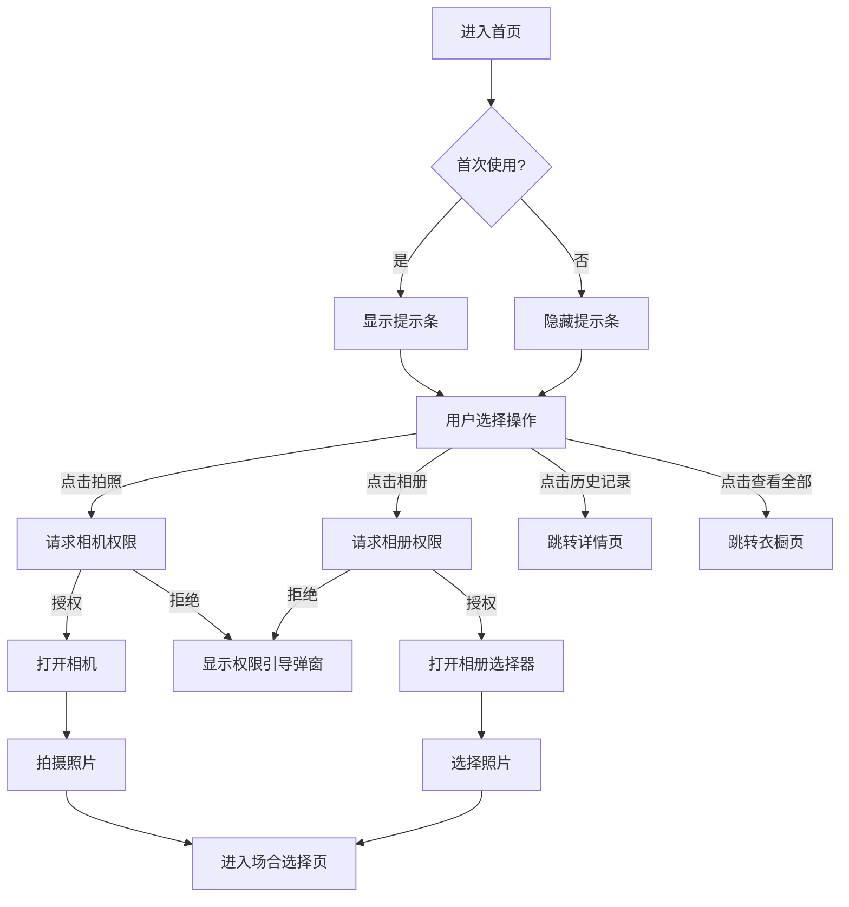

# 首页 - 智能搭配页

**页面标识：** `HomePage` / `HomeScreen`
**导航路径：** Tab Bar → 首页（默认首屏）
**设计版本：** v1.0 - L4 层叠卡片方向
**最后更新：** 2025-12-31

---

## 页面概述

### 页面目标
- **主要目标**：让用户快速上传单品照片，启动 AI 搭配流程
- **次要目标**：快速访问最近的搭配方案
- **情感目标**：传递"懂你的 AI 闺蜜"温暖感，建立信任

### 用户任务
1. **主任务**：拍照/选择照片 → 启动搭配生成
2. **次任务**：查看最近搭配记录
3. **支持任务**：了解使用提示

### 成功标准
- 核心流程 < 3 步完成（拍照 → 选择场合 → 生成）
- 首次用户能立即理解如何使用
- 拍照/相册按钮点击率 > 70%

---

## 设计方向

**基于：Direction L4 - 精致层叠卡片**

**核心视觉特征：**
- 紫色品牌渐变头部（`#6C63FF → #8578FF`）
- 白色内容卡片上浮覆盖（圆角 24px）
- 灰色背景 `#F2F2F7` 与白色卡片对比
- 层叠式布局，清晰的视觉层次

---

## 布局结构

### 页面区域划分

```
┌─────────────────────────────────┐
│  [状态栏 + 灵动岛]               │ 54px
│─────────────────────────────────│
│  [紫色头部区域]                  │ 141px
│  - 问候语："嗨，小雅"             │
│  - 副标题："今天想穿什么风格？"    │
│  - 头像                          │
│─────────────────────────────────│
│  [白色内容面板 - 可滚动]          │
│  ┌───────────────────────────┐  │
│  │ 智能搭配卡片              │  │ ~130px
│  │ - 标题 + 描述             │  │
│  │ - 拍照 / 相册按钮          │  │
│  └───────────────────────────┘  │
│                                 │
│  ┌───────────────────────────┐  │
│  │ 提示条（可选显示）         │  │ ~54px
│  │ "光线充足时拍摄，识别更准确" │  │
│  └───────────────────────────┘  │
│                                 │
│  [最近搭配]                     │
│  ┌───────────────────────────┐  │
│  │ 职场优雅风                │  │ ~72px
│  │ [通勤] 标签               │  │
│  └───────────────────────────┘  │
│                                 │
│  "查看全部" →                   │
│─────────────────────────────────│
│  [Tab Bar 毛玻璃]               │ 85px
│  首页 | 衣橱 | 我的              │
└─────────────────────────────────┘
```

### 响应式适配

| 设备类型 | 页面边距 | 卡片间距 | 按钮高度 |
|---------|---------|---------|---------|
| Compact (SE/mini) | 12px | 8px | 48px |
| Regular (14/15) | 16px | 10px | 48px |
| Large (Pro Max) | 20px | 12px | 52px |

---

## 组件清单

### 1. 头部区域 (Header Area)

**组件：** `HeaderGreeting`

**内容：**
- **问候语**："嗨，{用户昵称}"
  - 字号：32pt Bold
  - 颜色：白色 `#FFFFFF`
  - Letter-spacing: -0.5px

- **副标题**："今天想穿什么风格？"
  - 字号：17pt Regular
  - 颜色：白色 80% `rgba(255,255,255,0.8)`

- **头像**：右上角圆形头像
  - 尺寸：38×38px
  - 背景：毛玻璃效果 + 渐变
  - 可点击跳转到"我的"页面

**状态：**
- 默认显示
- 未登录时显示"嗨，访客"

---

### 2. 智能搭配卡片 (Action Card)

**组件：** `ActionCard`

**内容：**
- **标题**："智能搭配"
  - 字号：20pt Semibold
  - 颜色：黑色 `#000000`

- **描述**："拍下单品，AI 为你推荐最佳搭配"
  - 字号：14pt Regular
  - 颜色：灰色 `#86868B`

- **拍照按钮**（主按钮）
  - 背景：紫色渐变 `linear-gradient(180deg, #7069FF 0%, #6C63FF 100%)`
  - 文字：白色，16pt Semibold
  - 图标：相机 SVG 图标
  - 高度：48px
  - 圆角：12px
  - 阴影：`0 2px 8px rgba(108, 99, 255, 0.3)`

- **相册按钮**（次按钮）
  - 背景：灰色 `#E5E5EA`
  - 文字：黑色 `#1C1C1E`，16pt Semibold
  - 图标：图片 SVG 图标
  - 高度：48px
  - 圆角：12px

**交互：**
- 拍照按钮点击 → 打开系统相机（请求相机权限）
- 相册按钮点击 → 打开系统相册选择器
- 按钮 Hover：缩放 1.02
- 按钮 Active：缩放 0.98

**状态：**
- 默认可用
- 权限未授予：点击后弹窗请求权限

---

### 3. 提示条 (Tip Banner)

**组件：** `TipBanner`

**内容：**
- **图标**：黄色背景灯泡图标
  - 尺寸：30×30px
  - 背景渐变：`#FEF3C7 → #FDE68A`
  - 图标颜色：`#D97706`

- **文案**："光线充足时拍摄，识别更准确"
  - 字号：13pt Regular
  - 颜色：灰色 `#6B7280`

**显示逻辑：**
- 首次使用显示（前 3 次使用）
- 可手动关闭（右侧 ✕ 按钮）
- 关闭后不再显示

---

### 4. 最近搭配列表 (Recent Outfits)

**组件：** `RecentOutfits`

**标题栏：**
- **标题**："最近搭配"
  - 字号：18pt Semibold
  - 颜色：黑色 `#000000`

- **查看全部**：右侧链接
  - 字号：14pt Medium
  - 颜色：紫色 `#6C63FF`
  - 点击跳转到"衣橱"页面

**列表项：**
- **显示数量**：1 个（优化后）
- **缩略图**：52×52px 圆角 12px
  - 显示配色色块（渐变）

- **方案名称**："职场优雅风"
  - 字号：16pt Semibold
  - 颜色：黑色 `#000000`

- **描述**："适合正式商务场合"
  - 字号：13pt Regular
  - 颜色：灰色 `#86868B`

- **标签**："通勤"
  - 字号：12pt Semibold
  - 颜色：紫色 `#6C63FF`
  - 背景：紫色 10% `rgba(108, 99, 255, 0.1)`
  - 圆角：6px

**交互：**
- 点击列表项 → 跳转到方案详情页
- Active 状态：背景变为 `#F9F9F9`，缩放 0.99

**空状态：**
- 显示空状态插画 + 文案："还没有搭配方案，拍照试试吧"

---

## 滚动行为

### 内容面板滚动

**实现方式：**
```css
.content-panel {
  overflow-y: auto;
  -webkit-overflow-scrolling: touch; /* iOS 流畅滚动 */
  bottom: 85px; /* 为 Tab Bar 留出空间 */
}
```

**滚动规则：**
- 内容超出屏幕时自动显示滚动
- 使用 iOS 原生滚动指示器
- 支持橡皮筋效果（bounce）
- 滚动到顶部时显示紫色头部全貌

**性能优化：**
- 使用 CSS `will-change: scroll-position`
- 避免滚动时重绘头部固定元素

---

## 状态定义

### 1. 默认状态
- 显示完整布局
- 最近搭配显示 1 条记录
- 提示条可见（首次用户）

### 2. 空状态（无历史记录）
- 智能搭配卡片正常显示
- 提示条正常显示
- "最近搭配"区域显示空状态插画

### 3. 加载状态
- 页面初始化时显示骨架屏
- 头部区域优先加载
- 历史记录异步加载

### 4. 错误状态
- 相机/相册权限被拒绝：弹窗提示引导用户授权
- 网络错误：不影响查看历史记录

---

## 交互规范

### 核心交互流程



### 手势交互

| 手势 | 触发区域 | 响应 |
|------|---------|------|
| 点击 | 拍照按钮 | 打开相机 + Haptic Feedback (Medium) |
| 点击 | 相册按钮 | 打开相册 + Haptic Feedback (Medium) |
| 点击 | 历史记录项 | 跳转详情页 + Haptic Feedback (Light) |
| 点击 | 头像 | 跳转"我的"页面 |
| 滚动 | 内容面板 | 垂直滚动查看更多内容 |

---

## 动画规范

### 页面进入动画
- Tab 切换到首页：渐显（fade-in），200ms
- 首次启动：头部从上滑入，内容面板从下滑入，300ms

### 按钮交互动画
- **拍照/相册按钮**：
  - Hover：缩放 1.02，100ms `ease-out`
  - Active：缩放 0.98，100ms `ease-in`
  - 点击时 Haptic Feedback

### 列表项动画
- **历史记录点击**：
  - Active：背景变色 + 缩放 0.99，100ms

### 滚动动画
- iOS 原生橡皮筋效果
- 滚动指示器自动显示/隐藏

---

## 数据需求

### 需要从后端/本地获取的数据

**1. 用户信息**
```typescript
{
  userId: string;
  nickname: string;          // 显示在问候语中
  avatar?: string;           // 头像 URL（可选）
  isFirstTime: boolean;      // 是否首次使用
}
```

**2. 最近搭配记录**
```typescript
{
  outfitId: string;
  outfitName: string;        // "职场优雅风"
  description: string;       // "适合正式商务场合"
  occasion: string;          // "通勤"
  thumbnail: {               // 缩略图配色
    colors: string[];        // ["#6C63FF", "#8B83FF"]
  };
  createdAt: string;         // ISO 时间戳
}[]
```

**3. 提示条状态**
```typescript
{
  showTip: boolean;          // 是否显示提示条
  tipDismissed: boolean;     // 用户是否已关闭
}
```

### 数据加载策略
- 用户信息：同步加载（从本地缓存）
- 最近搭配：异步加载（本地 SQLite 查询，< 200ms）
- 提示条状态：本地存储（localStorage）

---

## 无障碍支持

### VoiceOver 标签

| 元素 | accessibilityLabel | accessibilityHint |
|------|-------------------|-------------------|
| 拍照按钮 | "拍照" | "拍摄衣服照片进行 AI 搭配" |
| 相册按钮 | "从相册选择" | "选择已有照片进行 AI 搭配" |
| 头像 | "个人资料" | "查看你的个人档案和设置" |
| 历史记录项 | "{方案名称}，{场合}标签" | "查看搭配详情" |
| 查看全部链接 | "查看全部搭配记录" | "跳转到衣橱页面" |

### 触摸目标尺寸
- 所有按钮 ≥ 44×44pt（iOS 标准）
- 拍照/相册按钮：48×48px
- 历史记录列表项：最小高度 72px

### 对比度
- 主按钮文字（白色 on 紫色）：5.8:1 ✅ AA
- 次按钮文字（黑色 on 灰色）：15.3:1 ✅ AAA
- 所有文字符合 WCAG 2.1 AA 标准

---

## 技术实现注意事项

### React Native 组件结构

```typescript
<SafeAreaView edges={['top', 'bottom']}>
  <View style={styles.screen}>
    {/* 头部区域 */}
    <View style={styles.headerArea}>
      <HeaderGreeting
        nickname={user.nickname}
        avatar={user.avatar}
        onAvatarPress={navigateToProfile}
      />
    </View>

    {/* 内容面板 - 可滚动 */}
    <ScrollView style={styles.contentPanel}>
      <ActionCard
        onCameraPress={handleCameraPress}
        onGalleryPress={handleGalleryPress}
      />

      {showTip && (
        <TipBanner
          message="光线充足时拍摄,识别更准确"
          onDismiss={handleTipDismiss}
        />
      )}

      <RecentOutfits
        outfits={recentOutfits}
        onOutfitPress={navigateToDetail}
        onViewAllPress={navigateToWardrobe}
      />
    </ScrollView>

    {/* Tab Bar */}
    <TabBar activeTab="home" />
  </View>
</SafeAreaView>
```

### 性能优化
- 使用 `FlatList` 渲染历史记录（如果未来扩展到多条）
- 图片懒加载
- 避免匿名函数导致重复渲染
- 使用 `React.memo` 优化组件

### 权限处理
```typescript
import { Camera } from 'expo-camera';
import * as ImagePicker from 'expo-image-picker';

// 请求相机权限
const requestCameraPermission = async () => {
  const { status } = await Camera.requestCameraPermissionsAsync();
  if (status !== 'granted') {
    // 显示权限引导弹窗
  }
};

// 请求相册权限
const requestGalleryPermission = async () => {
  const { status } = await ImagePicker.requestMediaLibraryPermissionsAsync();
  if (status !== 'granted') {
    // 显示权限引导弹窗
  }
};
```

---

## 原型文件

**可交互原型：** `home-page.html`

---

## 设计资源

- **Figma 源文件**：（待补充）
- **设计 Token**：参考 `ux-design-specification.md` → Design System Foundation
- **图标资源**：SF Symbols (`@expo/vector-icons`)

---

## 更新日志

| 版本 | 日期 | 更新内容 |
|-----|------|---------|
| v1.0 | 2025-12-31 | 初版：基于 L4 方向，优化滚动和布局 |
