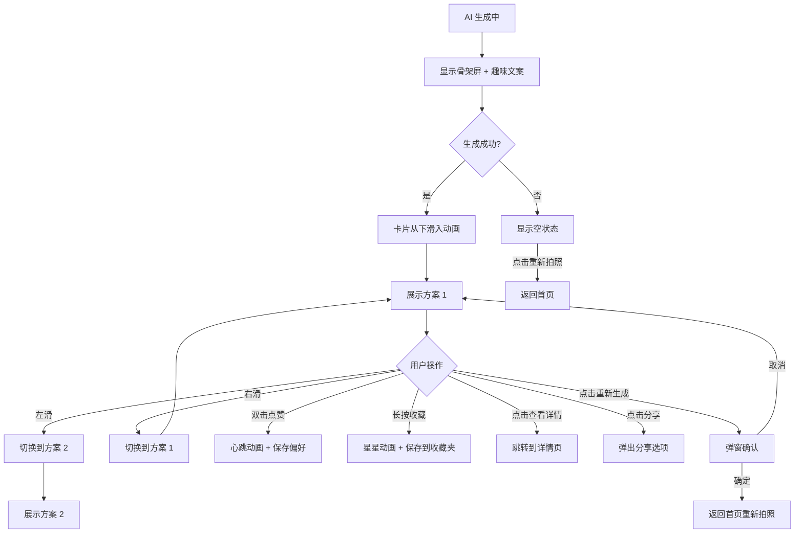

# 方案展示页 - 搭配结果

**页面标识：** `OutfitResultsPage` / `OutfitResultsScreen`
**导航路径：** 首页 → 拍照/选择照片 → 选择场合 → 方案展示页
**设计版本：** v1.0
**最后更新：** 2025-12-31

---

## 页面概述

### 页面目标
- **主要目标**：展示 AI 生成的 3 套个性化搭配方案，实现"5秒啊哈时刻"
- **次要目标**：收集用户反馈（点赞/收藏），优化 AI 学习
- **情感目标**：传递"眼前一亮"的惊喜感 + "恍然大悟"的赋能感

### 用户任务
1. **主任务**：浏览 3 套搭配方案，找到喜欢的
2. **次任务**：点赞/收藏喜欢的方案
3. **支持任务**：查看详细理论解析、分享方案

### 成功标准
- AI 生成时间 < 5 秒
- 首次体验完成率 > 70%
- 7 天内分享率 > 30%
- 用户对至少 1 套方案点赞/收藏率 > 80%

---

## 设计方向

**核心体验原则：** "5 秒啊哈时刻" - 让用户立刻感到"这就是我要的"

**视觉特征：**
- 卡片式布局，可左右滑动切换
- 高清商品图 + 精美排版
- 渐变背景（紫色系）增强品牌感
- 流畅的卡片切换动画

---

## 布局结构

### 页面区域划分

```
┌─────────────────────────────────┐
│  [导航栏]                        │ 44px
│  ← 返回    AI 为你推荐             │
│─────────────────────────────────│
│                                 │
│  [方案卡片轮播区 - 可左右滑动]     │ ~600px
│  ┌─────────────────────────┐   │
│  │ [方案 1 卡片]             │   │
│  │ - 3件单品组合图           │   │
│  │ - 方案名称                │   │
│  │ - 风格/场合标签           │   │
│  │ - 点赞/收藏按钮           │   │
│  └─────────────────────────┘   │
│       ⚫ ⚪ ⚪  指示器            │
│                                 │
│─────────────────────────────────│
│  [操作栏]                        │ ~120px
│  [查看详情] [分享] [重新生成]     │
└─────────────────────────────────┘
```

### 响应式适配

| 设备类型 | 卡片宽度 | 卡片间距 | 图片尺寸 |
|---------|---------|---------|---------|
| Compact (SE/mini) | 340px | 16px | 100×133px |
| Regular (14/15) | 361px | 16px | 110×147px |
| Large (Pro Max) | 390px | 20px | 120×160px |

---

## 组件清单

### 1. 导航栏 (Navigation Bar)

**组件：** `NavigationBar`

**内容：**
- **返回按钮**：左侧 ← 图标
  - 点击返回到首页
  - 带 Haptic Feedback (Light)

- **标题**："AI 为你推荐"
  - 字号：17pt Semibold
  - 颜色：黑色 `#000000`
  - 居中显示

- **重新生成按钮**（可选）：右侧刷新图标
  - 点击重新生成方案
  - 弹窗确认："确定重新生成吗？当前方案将丢失"

**样式：**
- 高度：44px（系统标准）
- 背景：白色半透明毛玻璃效果
- 底部分隔线：0.33px `rgba(0,0,0,0.12)`

---

### 2. 方案卡片 (Outfit Card)

**组件：** `OutfitCard`

**内容：**

**a. 单品组合区域**
- **3 件单品图片**：横向排列
  - 尺寸：110×147px（3:4 比例）
  - 圆角：12px
  - 间距：8px
  - 高清图片，支持点击放大查看

- **单品标签**：图片右上角
  - "上衣"、"下装"、"配饰"
  - 字号：10pt Semibold
  - 背景：黑色 50% 透明
  - 圆角：4px，padding: 4px 8px

**b. 方案信息区域**
- **方案名称**："职场优雅风"
  - 字号：22pt Bold
  - 颜色：黑色 `#000000`
  - Letter-spacing: -0.4px

- **描述文案**："米色阔腿裤搭配白色衬衫，营造通勤专业感"
  - 字号：15pt Regular
  - 颜色：灰色 `#6B7280`
  - 行高：1.4
  - 最多 2 行，超出省略

- **标签组**：风格 + 场合标签
  - 风格标签："简约风"
    - 背景：紫色 10% `rgba(108, 99, 255, 0.1)`
    - 文字：紫色 `#6C63FF`
  - 场合标签："职场通勤"
    - 背景：灰色 10%
    - 文字：黑色 `#1C1C1E`
  - 字号：13pt Semibold
  - 圆角：完全圆角（pill 形状）
  - 内边距：6px 12px

**c. 交互按钮区域**
- **点赞按钮**：心形图标
  - 默认：线条图标，灰色 `#8E8E93`
  - 点赞后：填充图标，红色 `#FF3B30`
  - 点赞动画：心跳放大 1.3 倍 + 粒子效果
  - 显示点赞数："128"

- **收藏按钮**：星形图标
  - 默认：线条图标，灰色 `#8E8E93`
  - 收藏后：填充图标，黄色 `#FFCC00`
  - 收藏动画：星星旋转 + 填充

- **分享按钮**：上传图标
  - 灰色图标
  - 点击弹出分享选项

**卡片样式：**
- 背景：白色
- 圆角：20px
- 阴影：`0 4px 16px rgba(0,0,0,0.12)`
- 内边距：20px

---

### 3. 卡片指示器 (Card Indicator)

**组件：** `PageIndicator`

**样式：**
- 3 个圆点，表示 3 套方案
- 当前卡片：紫色填充圆点 `#6C63FF`，直径 8px
- 其他卡片：灰色圆点 `#D1D1D6`，直径 6px
- 间距：8px
- 位置：卡片下方居中

---

### 4. 操作栏 (Action Bar)

**组件：** `ActionBar`

**按钮：**

**a. 查看详情按钮**（主按钮）
- 文案："查看搭配理论"
- 背景：紫色渐变 `linear-gradient(180deg, #7069FF 0%, #6C63FF 100%)`
- 文字：白色，16pt Semibold
- 高度：52px
- 圆角：14px
- 阴影：`0 2px 8px rgba(108, 99, 255, 0.3)`
- 点击跳转到方案详情页

**b. 分享按钮**（次按钮）
- 图标：上传图标
- 背景：灰色 `#F2F2F7`
- 尺寸：52×52px
- 圆角：14px
- 点击弹出分享选项

**c. 重新生成按钮**（次按钮）
- 图标：刷新图标
- 背景：灰色 `#F2F2F7`
- 尺寸：52×52px
- 圆角：14px
- 点击弹窗确认后重新生成

**布局：**
- 固定在底部
- 左侧：查看详情按钮（flex: 1）
- 右侧：分享 + 重新生成按钮（固定宽度）
- 间距：12px
- 内边距：16px
- 背景：白色毛玻璃效果

---

## 滚动与滑动行为

### 卡片滑动

**实现方式：**
- 使用 `ScrollView` 水平分页滚动
- `pagingEnabled={true}`（iOS 原生分页）
- `snapToInterval={cardWidth + cardSpacing}`（精确对齐）

**手势：**
- 左滑：查看下一套方案
- 右滑：查看上一套方案
- 点击卡片：无操作（避免误触）
- 双击卡片：放大查看单品图片

**边界处理：**
- 第一张卡片：不能继续右滑（橡皮筋效果）
- 最后一张卡片：不能继续左滑（橡皮筋效果）

---

## 状态定义

### 1. 加载状态（AI 生成中）

**显示内容：**
- 骨架屏展示 3 个卡片轮廓
- 脉冲动画（opacity 0.3 → 0.7，周期 1.5s）
- 趣味文案轮播（每 1.5 秒切换）：
  1. "AI 正在为你挑选最佳搭配..."
  2. "分析配色原理中..."
  3. "匹配你的风格偏好..."
  4. "马上就好，请稍等~"
- 进度条：0% → 100%，5 秒完成

**转场动画：**
- 骨架屏渐隐
- 真实卡片从下往上滑入（stagger 延迟 100ms）

---

### 2. 默认状态（方案已生成）

**显示内容：**
- 3 张完整的搭配卡片
- 第 1 张卡片默认居中显示
- 指示器显示当前位置
- 操作栏按钮可用

---

### 3. 空状态（生成失败）

**触发条件：**
- API 超时（> 10 秒）
- 识别失败（单品无法识别）
- 服务器错误

**显示内容：**
- 友好插画（云朵 + 问号）
- 标题："抱歉，AI 开小差了"
  - 字号：20pt Bold
  - 颜色：黑色 `#000000`

- 描述："识别失败，请换个角度重新拍摄"
  - 字号：15pt Regular
  - 颜色：灰色 `#6B7280`

- **重新拍照按钮**（主按钮）
  - 文案："重新拍照"
  - 紫色渐变背景

- **返回首页链接**（次要操作）
  - 文案："返回首页"
  - 紫色文字，无背景

---

### 4. 详情展开状态（未来扩展）

**触发：** 点击卡片单品图片

**显示内容：**
- 全屏展示单品大图
- 支持双指缩放
- 左右滑动切换单品
- 关闭按钮：右上角 ✕

---

## 交互规范

### 核心交互流程



### 手势交互

| 手势 | 触发区域 | 响应 |
|------|---------|------|
| 左滑 | 卡片区域 | 切换到下一套方案 + Haptic (Light) |
| 右滑 | 卡片区域 | 切换到上一套方案 + Haptic (Light) |
| 双击 | 点赞按钮 | 心跳动画 + Haptic (Medium) |
| 长按 | 收藏按钮 | 星星动画 + Haptic (Medium) |
| 点击 | 查看详情按钮 | 跳转详情页 + Haptic (Light) |
| 点击 | 返回按钮 | 返回首页 + Haptic (Light) |

---

## 动画规范

### 1. 卡片进入动画

**时机：** AI 生成完成后

**效果：**
- 3 张卡片依次从下往上滑入
- 延迟：第 1 张立即，第 2 张 +100ms，第 3 张 +200ms
- 动画时长：300ms
- 缓动曲线：`cubic-bezier(0.4, 0, 0.2, 1)`

---

### 2. 点赞动画

**时机：** 用户双击点赞按钮

**效果：**
- 心形图标放大 1.3 倍后回弹
- 填充颜色从灰色渐变到红色
- 粒子效果：5-8 个红色小心形向外扩散
- Haptic Feedback: Medium
- 动画时长：500ms

---

### 3. 收藏动画

**时机：** 用户长按收藏按钮

**效果：**
- 星形图标轻微旋转（15 度）
- 填充颜色从灰色渐变到黄色
- 闪烁效果（opacity 1 → 0.5 → 1）
- Haptic Feedback: Medium
- 动画时长：400ms

---

### 4. 卡片切换动画

**时机：** 用户左右滑动切换方案

**效果：**
- iOS 原生分页滚动动画
- 指示器同步更新（当前圆点放大 + 变色）
- 橡皮筋效果（边界处）
- 滚动速度：300ms

---

### 5. 骨架屏脉冲动画

**时机：** AI 生成等待中

**效果：**
- 卡片轮廓 opacity: 0.3 → 0.7 循环
- 周期：1.5s
- 缓动：`ease-in-out`
- 趣味文案每 1.5s 淡入淡出切换

---

## 数据需求

### 输入数据（从上一页传递）

```typescript
{
  uploadedImage: {
    uri: string;              // 用户上传的单品照片 URI
    type: string;             // "上衣" | "下装" | "配饰"
  };
  selectedOccasion: string;   // 用户选择的场合（"职场通勤" | "浪漫约会"...）
  userPreferences: {          // 用户个性化信息
    bodyType: string;         // 身材类型
    stylePreferences: string[]; // 风格偏好
  };
}
```

### 输出数据（API 返回）

```typescript
{
  outfits: [
    {
      outfitId: string;
      outfitName: string;           // "职场优雅风"
      description: string;          // "米色阔腿裤搭配白色衬衫..."
      styleTag: string;             // "简约风"
      occasionTag: string;          // "职场通勤"
      items: [
        {
          itemId: string;
          itemType: string;         // "上衣" | "下装" | "配饰"
          imageUrl: string;         // 高清图片 URL
          color: string;            // 主色调（hex）
          brand?: string;           // 品牌（可选）
        }
      ];
      colorTheory: {                // 配色理论（详情页用）
        primaryColors: string[];    // 主色调
        colorScheme: string;        // "互补色" | "对比色" | "同色系"
        colorWheel: object;         // 色轮数据
      };
      reasoning: string;            // 搭配理论解析（详情页用）
      likeCount: number;            // 点赞数
      isLiked: boolean;             // 用户是否已点赞
      isSaved: boolean;             // 用户是否已收藏
    }
  ];
  generationTime: number;           // 生成耗时（ms）
}
```

### 数据加载策略
- API 请求超时：10 秒
- 失败重试：最多 2 次
- 降级方案：展示规则引擎生成的基础搭配 + 提示"AI 正在学习中"

---

## 无障碍支持

### VoiceOver 标签

| 元素 | accessibilityLabel | accessibilityHint |
|------|-------------------|-------------------|
| 返回按钮 | "返回" | "返回到首页" |
| 方案卡片 | "{方案名称}，包含{单品1}、{单品2}、{单品3}" | "左右滑动查看其他方案" |
| 点赞按钮 | "点赞，当前 128 人点赞" | "双击为这套搭配点赞" |
| 收藏按钮 | "收藏，未收藏" | "双击收藏到你的穿搭知识库" |
| 查看详情按钮 | "查看搭配理论" | "查看配色原理和风格分析" |
| 分享按钮 | "分享" | "分享搭配方案到社交平台" |

### 触摸目标尺寸
- 所有按钮 ≥ 44×44pt
- 点赞/收藏/分享按钮：48×48px
- 查看详情按钮：全宽 × 52px

### 对比度
- 方案名称（黑色 on 白色）：15.3:1 ✅ AAA
- 描述文字（灰色 on 白色）：4.6:1 ✅ AA
- 主按钮（白色 on 紫色）：5.8:1 ✅ AA

---

## 技术实现注意事项

### React Native 组件结构

```typescript
<SafeAreaView edges={['top', 'bottom']}>
  <View style={styles.screen}>
    {/* 导航栏 */}
    <NavigationBar
      onBackPress={handleBack}
      onRegenerate={handleRegenerate}
    />

    {/* 卡片轮播 */}
    {isLoading ? (
      <SkeletonLoader tips={loadingTips} progress={progress} />
    ) : (
      <ScrollView
        horizontal
        pagingEnabled
        showsHorizontalScrollIndicator={false}
        onMomentumScrollEnd={handleCardChange}
      >
        {outfits.map((outfit) => (
          <OutfitCard
            key={outfit.outfitId}
            outfit={outfit}
            onLike={handleLike}
            onSave={handleSave}
            onShare={handleShare}
          />
        ))}
      </ScrollView>
    )}

    {/* 卡片指示器 */}
    <PageIndicator
      total={3}
      current={currentIndex}
    />

    {/* 操作栏 */}
    <ActionBar
      onViewDetail={() => navigateToDetail(currentOutfit)}
      onShare={() => handleShare(currentOutfit)}
      onRegenerate={handleRegenerate}
    />
  </View>
</SafeAreaView>
```

### 性能优化
- 使用 `FlatList` 替代 `ScrollView`（如果方案数量 > 5）
- 图片懒加载 + 缓存
- 点赞/收藏状态乐观更新（先更新 UI，后台同步）
- 避免匿名函数导致重复渲染

### 骨架屏实现
```typescript
import ShimmerPlaceholder from 'react-native-shimmer-placeholder';

<ShimmerPlaceholder
  style={styles.cardSkeleton}
  shimmerColors={['#F2F2F7', '#E5E5EA', '#F2F2F7']}
/>
```

---

## 原型文件

**可交互原型：** `outfit-results-page.html`（待创建）

---

## 更新日志

| 版本 | 日期 | 更新内容 |
|-----|------|---------|
| v1.0 | 2025-12-31 | 初版：基于"5秒啊哈时刻"原则设计 |
