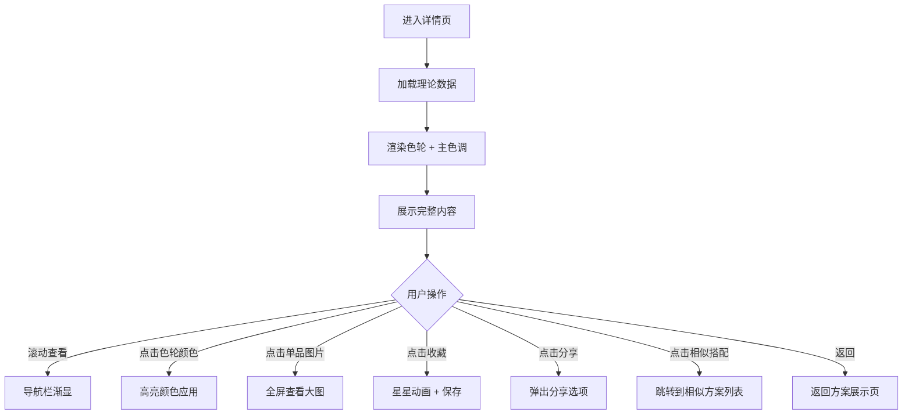

# 方案详情页 - 理论解析

**页面标识：** `OutfitDetailPage` / `OutfitDetailScreen`
**导航路径：** 方案展示页 → 点击"查看详情" → 方案详情页
**设计版本：** v1.0
**最后更新：** 2025-12-31

---

## 页面概述

### 页面目标
- **主要目标**：通过可视化理论解析，让用户理解"为什么这样搭"（差异化核心）
- **次要目标**：教育用户穿搭知识，建立长期价值
- **情感目标**：传递"恍然大悟"的顿悟感 + 知识赋能感

### 用户任务
1. **主任务**：理解这套搭配的理论依据（配色、风格、场合）
2. **次任务**：学习可复用的穿搭知识
3. **支持任务**：收藏方案、分享给朋友

### 成功标准
- 页面停留时长 > 1.5 分钟（深度阅读）
- 用户反馈"学到知识"的比例 > 80%
- 详情页访问率 > 60%（从方案展示页进入）

---

## 设计方向

**核心体验原则：** "恍然大悟" - 让抽象理论变得直观易懂

**视觉特征：**
- 全屏沉浸式展示
- 配色理论可视化（色轮、配色卡片）
- 通俗易懂的"闺蜜式"解析文案
- 分层信息架构（视觉 → 理论 → 依据）

---

## 布局结构

### 页面区域划分

```
┌─────────────────────────────────┐
│  [导航栏 - 半透明]               │ 44px
│  ← 返回    搭配理论               │
│─────────────────────────────────│
│                                 │
│  [方案预览区 - 可滚动]            │
│  ┌─────────────────────────┐   │
│  │ 3件单品组合大图           │   │ ~300px
│  │ 支持左右滑动查看单品      │   │
│  └─────────────────────────┘   │
│                                 │
│  [方案名称 + 标签]               │ ~80px
│  职场优雅风                      │
│  [简约风] [职场通勤]             │
│                                 │
│─────────────────────────────────│
│  [配色理论可视化区]              │
│  ┌─────────────────────────┐   │
│  │ 📊 配色原理              │   │ ~200px
│  │ ⚪ 色轮可视化（可交互）    │   │
│  │ 互补色对比营造专业感      │   │
│  └─────────────────────────┘   │
│                                 │
│  ┌─────────────────────────┐   │
│  │ 🎨 主色调提取            │   │ ~120px
│  │ [米色] [黑色] [白色]     │   │
│  └─────────────────────────┘   │
│                                 │
│─────────────────────────────────│
│  [风格分析区]                    │
│  ┌─────────────────────────┐   │
│  │ 🎭 风格解析              │   │ ~150px
│  │ 简约通勤风，适合职场...   │   │
│  └─────────────────────────┘   │
│                                 │
│  [搭配依据卡片组]                │ ~200px
│  ┌────┐ ┌────┐ ┌────┐         │
│  │配色│ │风格│ │身材│         │
│  │优化│ │适配│ │优化│         │
│  └────┘ └────┘ └────┘         │
│                                 │
│─────────────────────────────────│
│  [操作栏 - 固定底部]             │ 80px
│  [收藏] [分享] [试试相似搭配]    │
└─────────────────────────────────┘
```

### 响应式适配

| 设备类型 | 单品图尺寸 | 色轮直径 | 卡片宽度 |
|---------|-----------|---------|---------|
| Compact (SE/mini) | 100×133px | 180px | 100px |
| Regular (14/15) | 110×147px | 200px | 110px |
| Large (Pro Max) | 120×160px | 220px | 120px |

---

## 组件清单

### 1. 导航栏 (Navigation Bar)

**组件：** `NavigationBar`

**样式：**
- 半透明毛玻璃背景 `rgba(255,255,255,0.8)`
- 滚动时背景透明度变化（顶部时完全透明）
- 标题："搭配理论"
- 返回按钮：左侧 ← 图标

---

### 2. 方案预览区 (Outfit Preview)

**组件：** `OutfitPreview`

**内容：**
- **3 件单品大图**：横向排列，支持左右滑动
  - 尺寸：110×147px（3:4 比例）
  - 圆角：12px
  - 间距：12px
  - 点击可放大查看

- **单品标签**：图片底部
  - "上衣"、"下装"、"配饰"
  - 半透明黑色背景
  - 白色文字，12pt Semibold

**交互：**
- 左右滑动切换单品焦点
- 点击图片全屏查看（支持双指缩放）

---

### 3. 方案信息区 (Outfit Info)

**组件：** `OutfitInfo`

**内容：**
- **方案名称**："职场优雅风"
  - 字号：28pt Bold
  - 颜色：黑色 `#000000`
  - Letter-spacing: -0.5px

- **描述文案**："米色阔腿裤搭配白色衬衫，营造通勤专业感"
  - 字号：16pt Regular
  - 颜色：灰色 `#6B7280`
  - 行高：1.5

- **标签组**：
  - 风格标签："简约风"（紫色）
  - 场合标签："职场通勤"（灰色）
  - 内边距：8px 14px
  - 圆角：完全圆角（pill）

---

### 4. 配色理论可视化区 (Color Theory Visualization)

**组件：** `ColorTheoryVisualization`

**核心差异化组件 - 重点设计！**

#### a. 色轮可视化 (Color Wheel)

**视觉元素：**
- **色轮 SVG 图**：12 色标准色轮
  - 直径：200px
  - 中心：白色渐变到透明
  - 外圈：标准 12 色（红、橙、黄、绿、青、蓝、紫...）

- **色轮上的指示点**：
  - 提取搭配中的主色调（米色、黑色、白色）
  - 在色轮上标记位置
  - 连接线显示色彩关系（互补色、对比色）

**交互：**
- 点击色轮上的颜色：高亮该颜色在搭配中的应用
- 拖动指示点：动态演示不同配色效果（可选）

**理论解析文案：**
- 标题："互补色对比营造专业感"
  - 字号：17pt Semibold
  - 颜色：黑色 `#000000`

- 解析："米色与深色的搭配属于互补色对比，能够营造稳重专业的职场形象，同时保持视觉平衡"
  - 字号：15pt Regular
  - 颜色：灰色 `#6B7280`
  - 行高：1.5

---

#### b. 主色调提取 (Primary Colors)

**视觉元素：**
- **3-4 个配色卡片**：横向排列
  - 卡片尺寸：80×80px
  - 圆角：12px
  - 阴影：`0 2px 8px rgba(0,0,0,0.08)`
  - 填充颜色：提取的主色调

- **颜色名称**：卡片下方
  - "米色"、"黑色"、"白色"
  - 字号：13pt Medium
  - 颜色：灰色 `#6B7280`

- **颜色占比**：小字显示
  - "40%"、"30%"、"30%"
  - 字号：11pt Regular
  - 颜色：浅灰 `#9CA3AF`

**技术实现：**
- 使用颜色提取算法（Color Thief / Vibrant.js）
- 从 3 件单品图片中提取主色调
- 计算颜色占比

---

### 5. 风格分析区 (Style Analysis)

**组件：** `StyleAnalysis`

**内容：**

#### a. 风格解析卡片

**标题：** "🎭 风格解析"
- 字号：18pt Semibold
- 颜色：黑色 `#000000`

**解析文案：**
"简约通勤风，适合职场正式场合。利用中性色系营造专业稳重感，同时通过阔腿裤拉长腿部线条，展现优雅气质。"

- 字号：15pt Regular
- 颜色：灰色 `#3A3A3C`
- 行高：1.6
- 背景：白色卡片
- 内边距：20px
- 圆角：16px

---

#### b. 搭配依据卡片组 (Styling Reasons)

**组件：** `StylingReasonCards`

**卡片类型：**

**1. 配色原理卡片**
- 图标：🎨 调色板
- 标题："配色优化"
- 描述："互补色对比，增强视觉冲击"
- 背景：渐变（紫色 5%）

**2. 风格适配卡片**
- 图标：🎭 面具
- 标题："风格适配"
- 描述："简约通勤，符合职场氛围"
- 背景：渐变（蓝色 5%）

**3. 身材优化卡片**
- 图标：📏 尺子
- 标题："身材优化"
- 描述："阔腿裤拉长腿部线条"
- 背景：渐变（绿色 5%）

**4. 场合适配卡片**
- 图标：📍 定位
- 标题："场合适配"
- 描述："正式商务场合推荐"
- 背景：渐变（橙色 5%）

**卡片样式：**
- 尺寸：160×140px
- 圆角：14px
- 阴影：`0 2px 8px rgba(0,0,0,0.04)`
- 2×2 网格布局，间距 12px

---

### 6. 操作栏 (Action Bar)

**组件：** `ActionBar`

**按钮：**

**a. 收藏按钮**
- 图标：星形
- 文案："收藏"
- 样式：灰色背景 `#F2F2F7`
- 尺寸：48×48px
- 收藏后：填充黄色星星

**b. 分享按钮**
- 图标：上传
- 文案："分享"
- 样式：灰色背景 `#F2F2F7`
- 尺寸：48×48px

**c. 相似搭配按钮**（主按钮）
- 文案："试试相似搭配"
- 背景：紫色渐变
- 文字：白色，16pt Semibold
- 高度：52px
- flex: 1（占满剩余空间）
- 点击跳转到相似方案列表

**布局：**
- 固定在底部
- 毛玻璃背景
- 间距：12px
- 内边距：16px

---

## 滚动行为

### 页面滚动

**实现方式：**
```typescript
<ScrollView
  style={styles.container}
  showsVerticalScrollIndicator={true}
  scrollEventThrottle={16} // 监听滚动事件
  onScroll={handleScroll}
>
  {/* 页面内容 */}
</ScrollView>
```

**滚动效果：**
- 导航栏透明度变化：
  - 顶部（scrollY=0）：完全透明
  - 滚动后（scrollY>50）：渐变到 80% 透明度

- 标题渐显：
  - 顶部：隐藏标题
  - 滚动后：渐显"搭配理论"标题

---

## 状态定义

### 1. 默认状态

**显示内容：**
- 完整搭配理论解析
- 色轮可视化已渲染
- 主色调已提取
- 所有卡片可见

---

### 2. 加载状态

**触发条件：** 页面初始化，加载理论数据

**显示内容：**
- 骨架屏：色轮、卡片轮廓
- 脉冲动画
- 文案："AI 正在解析配色理论..."

---

### 3. 色轮交互状态

**触发条件：** 用户点击色轮上的颜色

**显示内容：**
- 高亮该颜色在搭配中的应用
- 底部弹出该颜色的详细说明
- 其他颜色变暗（opacity: 0.3）

---

### 4. 图片放大状态

**触发条件：** 用户点击单品图片

**显示内容：**
- 全屏展示单品大图
- 支持双指缩放
- 黑色半透明遮罩
- 右上角关闭按钮 ✕

---

## 交互规范

### 核心交互流程



### 手势交互

| 手势 | 触发区域 | 响应 |
|------|---------|------|
| 滚动 | 页面主体 | 垂直滚动 + 导航栏渐显 |
| 点击 | 色轮颜色 | 高亮该颜色应用 + Haptic (Light) |
| 点击 | 单品图片 | 全屏查看 + Haptic (Medium) |
| 双指缩放 | 全屏图片 | 缩放查看细节 |
| 点击 | 收藏按钮 | 星星动画 + Haptic (Medium) |
| 点击 | 分享按钮 | 弹出分享面板 + Haptic (Light) |
| 左右滑动 | 单品预览区 | 切换单品焦点 |

---

## 动画规范

### 1. 页面进入动画

**时机：** 从方案展示页跳转进入

**效果：**
- 页面从右往左滑入（iOS 标准 push 动画）
- 动画时长：300ms
- 缓动曲线：`cubic-bezier(0.4, 0, 0.2, 1)`

---

### 2. 色轮渲染动画

**时机：** 页面加载完成后

**效果：**
- 色轮从中心向外扩展（scale: 0 → 1）
- 指示点依次弹出（延迟 100ms）
- 连接线逐步绘制
- 动画时长：600ms

---

### 3. 主色调卡片进入

**时机：** 色轮渲染完成后

**效果：**
- 3-4 个卡片依次从下往上滑入
- 延迟：第 1 张立即，第 2 张 +80ms，第 3 张 +160ms
- 动画时长：300ms

---

### 4. 色轮交互动画

**时机：** 用户点击色轮颜色

**效果：**
- 被点击颜色的指示点放大 1.2 倍
- 其他颜色透明度降低到 30%
- 底部说明面板从下滑入
- Haptic Feedback: Light

---

### 5. 图片放大动画

**时机：** 用户点击单品图片

**效果：**
- 图片从当前位置放大到全屏（Hero 动画）
- 黑色遮罩渐显
- 动画时长：300ms
- Haptic Feedback: Medium

---

## 数据需求

### 输入数据（从方案展示页传递）

```typescript
{
  outfitId: string;
  outfitName: string;
  description: string;
  styleTag: string;
  occasionTag: string;
  items: [
    {
      itemId: string;
      itemType: string;
      imageUrl: string;
      color: string;
    }
  ];
  colorTheory: {
    primaryColors: string[];      // ["#D4C5B0", "#000000", "#FFFFFF"]
    colorScheme: string;           // "互补色"
    colorWheel: {
      positions: [                 // 色轮上的位置
        { color: "#D4C5B0", angle: 45, name: "米色" },
        { color: "#000000", angle: 180, name: "黑色" },
        { color: "#FFFFFF", angle: 0, name: "白色" }
      ];
      relationships: [             // 颜色关系连接线
        { from: 0, to: 1, type: "complementary" }
      ];
    };
  };
  reasoning: string;               // 搭配理论解析文案
  stylingReasons: [                // 搭配依据
    {
      type: "color" | "style" | "body" | "occasion";
      title: string;
      description: string;
    }
  ];
}
```

### 颜色提取技术实现

```typescript
// 使用 Color Thief 或 Vibrant.js 提取主色调
import ColorThief from 'color-thief-react';

const extractColors = async (imageUrl: string) => {
  const colorThief = new ColorThief();
  const palette = await colorThief.getPalette(imageUrl, 3);
  return palette.map(rgb => rgbToHex(rgb));
};
```

---

## 无障碍支持

### VoiceOver 标签

| 元素 | accessibilityLabel | accessibilityHint |
|------|-------------------|-------------------|
| 返回按钮 | "返回" | "返回到搭配方案列表" |
| 单品图片 | "{单品类型}，{颜色}" | "双击放大查看" |
| 色轮 | "配色理论色轮" | "展示搭配中的颜色关系" |
| 主色调卡片 | "{颜色名称}，占比 {百分比}" | "" |
| 收藏按钮 | "收藏，未收藏" | "双击收藏到你的知识库" |
| 分享按钮 | "分享" | "分享搭配理论到社交平台" |
| 相似搭配按钮 | "试试相似搭配" | "查看类似风格的其他搭配方案" |

### 触摸目标尺寸
- 所有按钮 ≥ 44×44pt
- 收藏/分享按钮：48×48px
- 相似搭配按钮：全宽 × 52px
- 色轮指示点：≥ 32×32px

### 对比度
- 理论解析文字（黑色 on 白色）：15.3:1 ✅ AAA
- 描述文字（灰色 on 白色）：4.6:1 ✅ AA
- 卡片标题（黑色 on 彩色背景 5%）：需确保 > 4.5:1

---

## 技术实现注意事项

### React Native 组件结构

```typescript
<SafeAreaView edges={['top', 'bottom']}>
  <ScrollView
    onScroll={handleScroll}
    scrollEventThrottle={16}
  >
    {/* 导航栏 */}
    <AnimatedNavigationBar opacity={navOpacity} />

    {/* 方案预览 */}
    <OutfitPreview
      items={outfit.items}
      onImagePress={handleImagePress}
    />

    {/* 方案信息 */}
    <OutfitInfo
      name={outfit.outfitName}
      description={outfit.description}
      tags={[outfit.styleTag, outfit.occasionTag]}
    />

    {/* 配色理论可视化 */}
    <ColorTheoryVisualization
      colorTheory={outfit.colorTheory}
      onColorPress={handleColorPress}
    />

    {/* 主色调 */}
    <PrimaryColors colors={outfit.colorTheory.primaryColors} />

    {/* 风格分析 */}
    <StyleAnalysis reasoning={outfit.reasoning} />

    {/* 搭配依据 */}
    <StylingReasonCards reasons={outfit.stylingReasons} />
  </ScrollView>

  {/* 操作栏 - 固定底部 */}
  <ActionBar
    onSave={handleSave}
    onShare={handleShare}
    onSimilar={handleSimilar}
  />
</SafeAreaView>
```

### 色轮 SVG 实现

```typescript
import Svg, { Circle, Path, Line } from 'react-native-svg';

<Svg width={200} height={200}>
  {/* 12 色色轮 */}
  {colorWheel.map((color, index) => (
    <Path
      key={index}
      d={calculateArcPath(index)}
      fill={color}
      onPress={() => handleColorPress(index)}
    />
  ))}

  {/* 指示点 */}
  {positions.map((pos, index) => (
    <Circle
      key={index}
      cx={calculateX(pos.angle)}
      cy={calculateY(pos.angle)}
      r={12}
      fill={pos.color}
      stroke="#fff"
      strokeWidth={3}
    />
  ))}

  {/* 连接线 */}
  {relationships.map((rel, index) => (
    <Line
      key={index}
      x1={positions[rel.from].x}
      y1={positions[rel.from].y}
      x2={positions[rel.to].x}
      y2={positions[rel.to].y}
      stroke="#6C63FF"
      strokeWidth={2}
      strokeDasharray="4 4"
    />
  ))}
</Svg>
```

### 性能优化
- 色轮 SVG 使用 memo 避免重复渲染
- 图片懒加载 + 缓存
- 滚动监听使用 `Animated.event` 优化性能
- 避免在滚动回调中使用 `setState`

---

## 原型文件

**可交互原型：** `outfit-detail-page.html`（待创建）

---

## 更新日志

| 版本 | 日期 | 更新内容 |
|-----|------|---------|
| v1.0 | 2025-12-31 | 初版：配色理论可视化 + 风格分析 |
