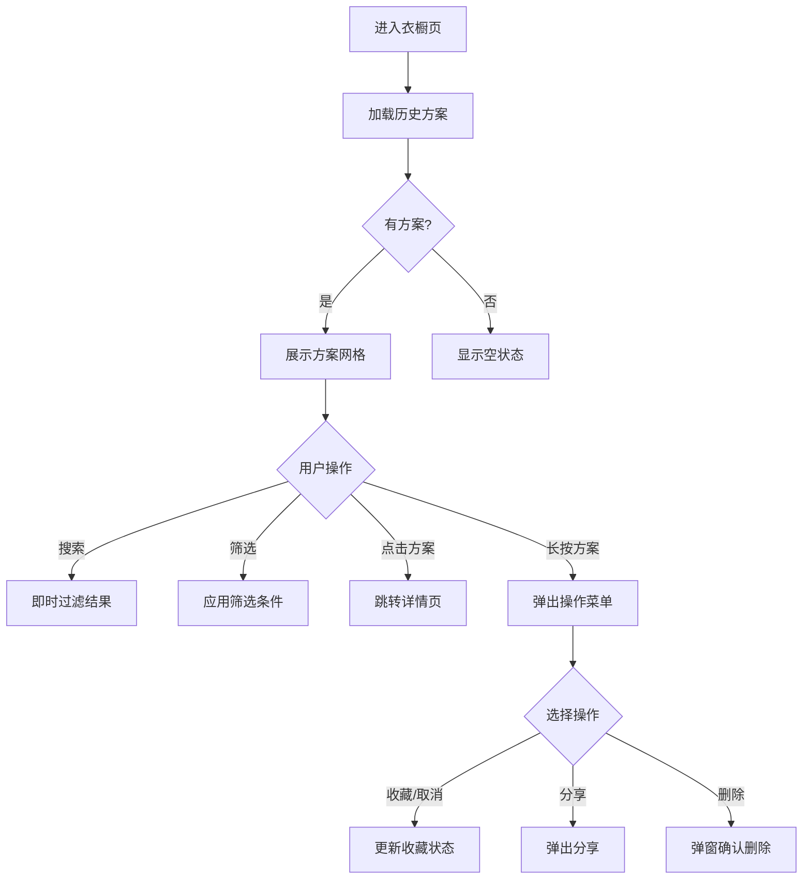

# 衣橱页 - 历史方案列表

**页面标识:** `WardrobePage` / `WardrobeScreen`  
**导航路径:** Tab Bar → 衣橱  
**设计版本:** v1.0  
**最后更新:** 2025-12-31

---

## 页面概述

### 页面目标
- **主要目标:** 快速查找历史搭配方案 (< 200ms 响应)
- **次要目标:** 多维度筛选和搜索
- **情感目标:** 看到自己的穿搭成长轨迹

### 用户任务
1. **主任务:** 查找之前的搭配方案
2. **次任务:** 按场合/时间/收藏筛选
3. **支持任务:** 删除不喜欢的方案

### 成功标准
- 查询响应时间 < 200ms (本地 SQLite)
- 找到目标方案的成功率 > 90%
- 历史方案访问率 > 40%

---

## 布局结构

```
┌─────────────────────────────────┐
│  [搜索栏 + 筛选按钮]             │ 56px
│  🔍 搜索搭配...     [筛选图标]   │
│─────────────────────────────────│
│  [场合标签栏 - 横向滚动]         │ 48px
│  全部 通勤 约会 休闲 聚会 运动  │
│─────────────────────────────────│
│  [方案网格 - 2列 - 可滚动]       │
│  ┌──────┐  ┌──────┐            │
│  │方案1 │  │方案2 │            │
│  │缩略图│  │缩略图│            │
│  └──────┘  └──────┘            │
│  ┌──────┐  ┌──────┐            │
│  │方案3 │  │方案4 │            │
│  └──────┘  └──────┘            │
│─────────────────────────────────│
│  [Tab Bar]                      │ 85px
└─────────────────────────────────┘
```

---

## 组件清单

### 1. 搜索栏 (Search Bar)
- 占位符: "搜索搭配方案..."
- 即时搜索 (输入后 300ms 触发)
- 搜索历史: 最近 5 条

### 2. 筛选器 (Filter Bar)
**场合筛选:** 横向滚动标签
- 全部、通勤、约会、休闲、聚会、运动、居家
- 选中状态: 紫色背景 + 白色文字

**高级筛选:** 点击筛选图标弹出
- 时间筛选: 今天/本周/本月/更早
- 收藏筛选: 仅显示收藏
- 排序: 时间/点赞数

### 3. 方案网格 (Outfit Grid)
**网格规格:**
- 2 列布局
- 列间距: 12px
- 行间距: 16px

**方案卡片:**
- 缩略图: 正方形,圆角 12px
- 方案名称: 16pt Semibold
- 场合标签: 小芯片
- 时间戳: "2天前"
- 收藏标记: 右上角星星图标

**空状态:**
- 插画: 空衣橱
- 文案: "还没有搭配方案,拍照试试吧"
- 按钮: "去生成搭配"

---

## 交互规范

### 核心交互流程


---

## 数据需求

```typescript
{
  outfits: [
    {
      outfitId: string;
      outfitName: string;
      thumbnailUrl: string;      // 缩略图
      occasionTag: string;
      createdAt: string;         // ISO 时间戳
      isSaved: boolean;          // 是否收藏
      likeCount: number;
    }
  ];
  totalCount: number;
  filters: {
    occasion?: string;
    timeRange?: string;
    savedOnly?: boolean;
  };
}
```

---

## 技术实现

### 本地 SQLite 查询优化
```sql
-- 创建索引加速查询
CREATE INDEX idx_occasion ON outfits(occasion);
CREATE INDEX idx_created_at ON outfits(created_at DESC);
CREATE INDEX idx_saved ON outfits(is_saved);

-- 分页查询
SELECT * FROM outfits
WHERE occasion = ? AND is_saved = ?
ORDER BY created_at DESC
LIMIT 20 OFFSET 0;
```

### React Native 实现
```typescript
<SafeAreaView>
  <SearchBar onSearch={handleSearch} />
  <FilterBar onFilter={handleFilter} />
  
  <FlatList
    data={outfits}
    renderItem={({item}) => <OutfitCard outfit={item} />}
    numColumns={2}
    keyExtractor={(item) => item.outfitId}
    onEndReached={loadMore}
  />
  
  <TabBar activeTab="wardrobe" />
</SafeAreaView>
```

---

## 更新日志

| 版本 | 日期 | 更新内容 |
|-----|------|---------|
| v1.0 | 2025-12-31 | 初版:2列网格+多维度筛选 |
