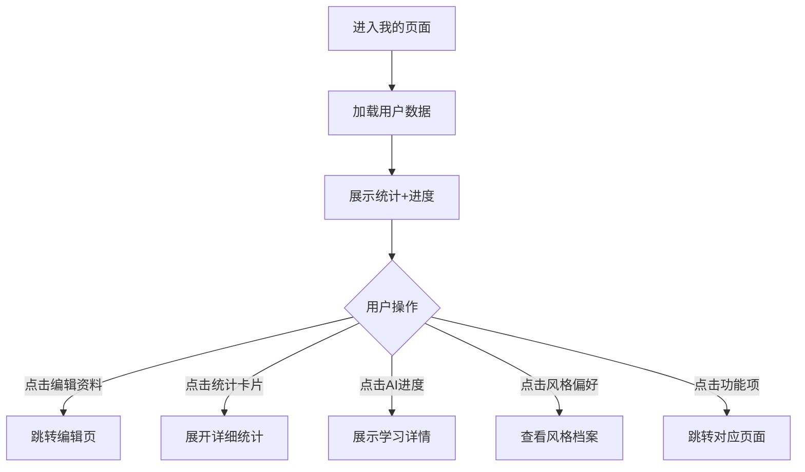

# 个人档案页 - 我的

**页面标识:** `ProfilePage` / `ProfileScreen`  
**导航路径:** Tab Bar → 我的  
**设计版本:** v1.0  
**最后更新:** 2025-12-31

---

## 页面概述

### 页面目标
- **主要目标:** 展示用户成长数据和 AI 学习进度
- **次要目标:** 个性化设置管理
- **情感目标:** 传递"成长可见"的成就感

### 用户任务
1. **主任务:** 查看穿搭成长轨迹
2. **次任务:** 管理个性化偏好
3. **支持任务:** 应用设置

### 成功标准
- 用户停留时长 > 30 秒
- 风格档案查看率 > 40%
- AI 学习进度可感知度 > 80%

---

## 布局结构

```
┌─────────────────────────────────┐
│  [头像 + 昵称区域]               │ ~120px
│  ┌────┐                          │
│  │头像│ 小雅                      │
│  └────┘ 编辑资料 →               │
│─────────────────────────────────│
│  [统计数据卡片 - 可滚动]         │
│  ┌─────────────────────────┐   │
│  │ 📊 我的穿搭数据         │   │ ~180px
│  │ ┌────┐ ┌────┐ ┌────┐  │   │
│  │ │ 28 │ │ 15 │ │ 12 │  │   │
│  │ │套  │ │收藏│ │分享│  │   │
│  │ └────┘ └────┘ └────┘  │   │
│  └─────────────────────────┘   │
│                                 │
│  ┌─────────────────────────┐   │
│  │ 🎯 AI 学习进度          │   │ ~200px
│  │      ⭕ 75%             │   │
│  │  AI 越来越懂你了！       │   │
│  └─────────────────────────┘   │
│                                 │
│  ┌─────────────────────────┐   │
│  │ 🏷️ 你的风格偏好         │   │ ~160px
│  │  简约45% 时尚30% 甜美25%│   │
│  │  [标签云可视化]          │   │
│  └─────────────────────────┘   │
│                                 │
│  [功能列表]                     │
│  收藏夹 →                       │
│  个性化设置 →                   │
│  应用设置 →                     │
│  关于搭理 →                     │
│─────────────────────────────────│
│  [Tab Bar]                      │ 85px
└─────────────────────────────────┘
```

---

## 组件清单

### 1. 头像 + 昵称区域
**内容:**
- 头像: 80×80px, 圆形
- 昵称: 24pt Bold
- 编辑资料按钮: 右侧箭头

### 2. 穿搭数据卡片
**统计项:**
- 已生成方案数: "28 套"
- 收藏数: "15 个"
- 分享数: "12 次"

**样式:**
- 白色卡片背景
- 3列均分布局
- 数字: 28pt Bold, 紫色
- 标签: 13pt Regular, 灰色

### 3. AI 学习进度卡片 (核心差异化)
**组件:** `ProgressCircle`

**视觉元素:**
- 环形进度条: 200px 直径
- 中心百分比: "75%", 32pt Bold
- 进度颜色渐变:
  - 0-25%: 橙色
  - 26-50%: 黄色
  - 51-75%: 绿色
  - 76-100%: 紫色

**提示文案:**
- 0-25%: "多点几次赞,AI会更懂你"
- 26-50%: "AI正在学习你的风格"
- 51-75%: "AI越来越懂你了"
- 76-100%: "AI已经很懂你啦!"

### 4. 风格偏好标签云
**组件:** `PreferenceCloud`

**内容:**
- 风格偏好: "简约45% / 时尚30% / 甜美25%"
- 场合偏好: "通勤40% / 约会25% / 休闲20%"
- 配色偏好: "黑白灰 / 莫兰迪 / 大地色"

**可视化:**
- 词云布局
- 标签大小反映使用频率
- 紫色系渐变

### 5. 功能列表
**列表项:**
- 收藏夹: 查看所有收藏的方案
- 个性化设置: 修改身材/风格偏好
- 应用设置: 通知/隐私/语言
- 关于搭理: 版本信息/用户协议

---

## 交互规范

### 核心交互流程


---

## 动画规范

### 1. AI 进度环动画
**时机:** 页面加载完成

**效果:**
- 环形从 0% 顺时针填充到目标值
- 中心数字递增动画
- 动画时长: 1.5s
- 缓动: `ease-out`

### 2. 标签云渐显
**时机:** 滚动到标签云区域

**效果:**
- 标签依次淡入
- 延迟: 每个 +50ms
- 动画时长: 300ms

---

## 数据需求

```typescript
{
  user: {
    userId: string;
    nickname: string;
    avatar: string;
    memberSince: string;       // 注册时间
  };
  stats: {
    totalOutfits: number;      // 已生成方案数
    savedCount: number;        // 收藏数
    sharedCount: number;       // 分享数
  };
  aiLearningProgress: {
    percentage: number;        // 0-100
    level: "beginner" | "intermediate" | "advanced";
  };
  preferences: {
    stylePreferences: [
      { style: "简约", percentage: 45 },
      { style: "时尚", percentage: 30 },
      { style: "甜美", percentage: 25 }
    ];
    occasionPreferences: [...];
    colorPreferences: [...];
  };
}
```

---

## 技术实现

### React Native 实现
```typescript
<SafeAreaView>
  <ScrollView>
    {/* 头像区域 */}
    <ProfileHeader
      avatar={user.avatar}
      nickname={user.nickname}
      onEdit={handleEdit}
    />

    {/* 统计卡片 */}
    <StatsCard stats={stats} />

    {/* AI 进度环 */}
    <ProgressCircle
      percentage={aiLearningProgress.percentage}
      level={aiLearningProgress.level}
    />

    {/* 风格偏好 */}
    <PreferenceCloud preferences={preferences} />

    {/* 功能列表 */}
    <FunctionList onItemPress={handleNavigation} />
  </ScrollView>

  <TabBar activeTab="profile" />
</SafeAreaView>
```

---

## 更新日志

| 版本 | 日期 | 更新内容 |
|-----|------|---------|
| v1.0 | 2025-12-31 | 初版:AI进度环+风格档案 |
