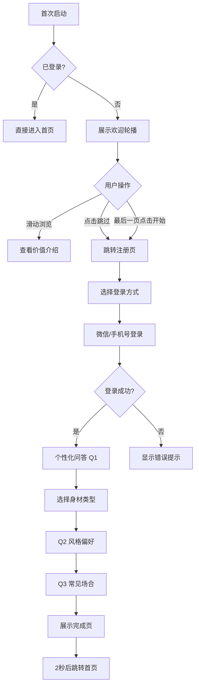

# 欢迎引导页 - 注册与个性化

**页面标识:** `WelcomeOnboardingPage`  
**导航路径:** 首次启动 → 欢迎引导 → 首页  
**设计版本:** v1.0  
**最后更新:** 2025-12-31

---

## 页面概述

### 页面目标
- **主要目标:** 30秒内完成注册+个性化问答,转化率 > 60%
- **次要目标:** 收集用户个性化信息(身材/风格/场合)
- **情感目标:** 传递"被重视"+"期待"的感觉

### 用户任务
1. **主任务:** 完成注册(微信一键登录)
2. **次任务:** 回答 3-5 个个性化问题
3. **支持任务:** 理解产品价值

### 成功标准
- 总时长 < 30 秒
- 注册转化率 > 60%
- 完成个性化问答率 > 80%

---

## 布局结构

### 流程: 欢迎页 → 注册页 → 个性化问答(3步) → 完成

```
┌─────────────────────────────────┐
│ [欢迎页 - Slide 1]               │
│                                 │
│       🎨 插画                    │
│                                 │
│   搭理 - 你的AI穿搭顾问          │
│   拍下衣服,AI秒懂搭配            │
│                                 │
│   [跳过]         [下一步] →     │
└─────────────────────────────────┘

┌─────────────────────────────────┐
│ [注册页]                         │
│                                 │
│     👋 欢迎来到搭理              │
│                                 │
│  [🟢 微信一键登录]               │
│  [📱 手机号登录]                 │
│                                 │
│  已阅读并同意《用户协议》        │
└─────────────────────────────────┘

┌─────────────────────────────────┐
│ [个性化问答 - 1/3]               │
│  ● ⚪ ⚪  进度                   │
│                                 │
│  你的身材类型是?                 │
│  (帮助AI更精准推荐)              │
│                                 │
│  ┌──────┐  ┌──────┐            │
│  │ 梨形 │  │苹果形│            │
│  │ 插画 │  │ 插画 │            │
│  └──────┘  └──────┘            │
│  ┌──────┐  ┌──────┐            │
│  │沙漏形│  │直筒形│            │
│  └──────┘  └──────┘            │
│                                 │
│  [跳过]            [下一步] →   │
└─────────────────────────────────┘
```

---

## 页面流程

### 1. 欢迎轮播页 (3 slides)

**Slide 1: 产品价值**
- 插画: AI机器人+衣服
- 标题: "搭理 - 你的AI穿搭顾问"
- 描述: "拍下衣服,AI秒懂搭配"

**Slide 2: 知识赋能**
- 插画: 色轮+理论
- 标题: "不只告诉你怎么搭"
- 描述: "更教你为什么这样搭"

**Slide 3: 个性化学习**
- 插画: 成长曲线
- 标题: "AI越用越懂你"
- 描述: "每次点赞都在帮AI学习你的风格"

**操作:**
- 左右滑动切换
- 指示器: ● ⚪ ⚪
- 跳过按钮: 右上角
- 开始使用按钮: 最后一页

---

### 2. 注册页

**登录方式:**
- 微信一键登录(主推荐)
- 手机号登录(备选)
- Apple ID 登录(iOS 必须)

**协议勾选:**
- 默认不勾选
- 必须勾选才能继续
- 点击查看《用户协议》和《隐私政策》

---

### 3. 个性化问答 (3-5 questions)

**Q1: 身材类型 (必选)**
- 梨形 / 苹果形 / 沙漏形 / 直筒形
- 卡片选择(带插画)
- 单选

**Q2: 风格偏好 (必选,多选)**
- 简约 / 时尚 / 甜美 / 知性 / 酷飒 / 文艺
- 芯片多选
- 至少选 1 个,最多 3 个

**Q3: 常见场合 (必选,多选)**
- 职场通勤 / 浪漫约会 / 休闲娱乐 / 聚会派对 / 运动健身 / 居家休闲
- 图标化卡片
- 至少选 1 个,最多 3 个

**可选问题 (可跳过):**
- Q4: 年龄段 (18-25 / 26-32 / 33-38)
- Q5: 预算范围 (性价比 / 中档 / 高档)

**设计要点:**
- 进度指示器: ● ⚪ ⚪ (顶部)
- 价值提示: "帮助AI更精准推荐"
- 跳过按钮: 左下角(灰色文字)
- 下一步按钮: 右下角(紫色主按钮)
- 返回按钮: 左上角 ←

---

### 4. 完成页

**视觉元素:**
- 成功插画(打勾动画)
- 标题: "太棒了!一切就绪"
- 描述: "AI正在为你生成专属风格档案..."

**自动跳转:**
- 2 秒后自动跳转到首页
- 或点击"开始搭配"按钮立即进入

---

## 组件清单

### 1. 欢迎轮播组件
```typescript
<Swiper
  loop={false}
  showsPagination={true}
  paginationStyle={styles.pagination}
>
  {slides.map(slide => (
    <WelcomeSlide key={slide.id} {...slide} />
  ))}
</Swiper>
```

### 2. 身材类型选择卡片
- 插画: 简笔画身材示意图
- 尺寸: 160×180px
- 圆角: 16px
- 选中: 紫色边框 3px

### 3. 风格标签芯片
- Pill 形状
- 默认: 灰色背景
- 选中: 紫色背景+白色文字

### 4. 进度指示器
- 圆点: 8px
- 当前: 紫色填充
- 未完成: 灰色边框

---

## 交互规范

### 核心交互流程


---

## 动画规范

### 1. 轮播切换动画
- 左右滑动: 视差效果
- 动画时长: 300ms

### 2. 登录按钮加载
- 微信登录点击后: Spinner + "登录中..."
- 动画时长: 持续到登录完成

### 3. 完成页动画
- 打勾图标: 从小到大弹出
- 文案: 渐显
- 总时长: 800ms

---

## 数据需求

### 输出数据
```typescript
{
  user: {
    userId: string;
    nickname: string;
    avatar: string;
    authProvider: "wechat" | "phone" | "apple";
  };
  onboardingData: {
    bodyType: "pear" | "apple" | "hourglass" | "rectangle";
    stylePreferences: string[];    // ["简约", "时尚"]
    commonOccasions: string[];     // ["职场通勤", "休闲娱乐"]
    ageRange?: string;
    budgetRange?: string;
  };
  completedAt: string;             // ISO 时间戳
}
```

---

## 技术实现

### 微信登录
```typescript
import * as WeChat from 'react-native-wechat-lib';

const handleWeChatLogin = async () => {
  const result = await WeChat.sendAuthRequest('snsapi_userinfo');
  const { code } = result;
  // 发送 code 到后端换取 token
};
```

### Apple ID 登录
```typescript
import * as AppleAuthentication from 'expo-apple-authentication';

const handleAppleLogin = async () => {
  const credential = await AppleAuthentication.signInAsync({
    requestedScopes: [
      AppleAuthentication.AppleAuthenticationScope.FULL_NAME,
      AppleAuthentication.AppleAuthenticationScope.EMAIL,
    ],
  });
};
```

---

## 无障碍支持

- 所有按钮 ≥ 44×44pt
- 协议链接下划线标识
- VoiceOver 完整支持
- 对比度符合 WCAG AA

---

## 更新日志

| 版本 | 日期 | 更新内容 |
|-----|------|---------|
| v1.0 | 2025-12-31 | 初版:30秒快速注册+个性化 |
