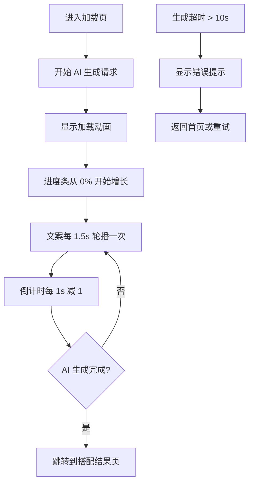

# AI 生成中页面

**页面标识:** `AILoadingScreen`
**导航路径:** 选择场合 → AI 生成中 → 搭配方案结果
**设计版本:** v1.0 - 全屏加载状态
**最后更新:** 2025-12-31

---

## 页面概述

### 页面目标
- **主要目标**: 让用户清楚了解 AI 正在处理，降低焦虑感
- **次要目标**: 通过动效和文案传递"专业 AI 处理"的价值感
- **情感目标**: 传递"AI 正在精心为你挑选"的期待感

### 用户任务
1. **主任务**: 等待 AI 生成完成（预计 3-5 秒）
2. **次任务**: 理解 AI 正在做什么（通过文案轮播）

### 成功标准
- 用户不会觉得等待时间过长
- 加载时间感知 < 实际时间（通过动效和文案分散注意力）
- 无中途退出行为

---

## 设计方向

**全屏加载状态设计**

**核心视觉特征:**
- 浅灰背景 `#F2F2F7`
- 紫色品牌色加载图标（脉动动画）
- 骨架屏预览搭配卡片结构
- 流畅的进度条动画

---

## 布局结构

### 页面区域划分

```
┌─────────────────────────────────┐
│  [状态栏 + 灵动岛]               │ 59px
│─────────────────────────────────│
│  [内容区域]                      │
│                                 │
│  ┌───────────────────────────┐  │
│  │ [加载图标 - 脉动]         │  │ 80px
│  │      ⚙️                   │  │
│  └───────────────────────────┘  │
│                                 │
│  [AI 正在创作中]                │ 36px
│                                 │
│  [AI 正在为你挑选最佳搭配...]   │ 44px
│  (文案轮播)                     │
│                                 │
│  ┌───────────────────────────┐  │
│  │ [进度条]                  │  │ 6px
│  │ ████████░░░░░░            │  │
│  └───────────────────────────┘  │
│  预计还需 3 秒                  │ 20px
│                                 │
│  ┌───────────────────────────┐  │
│  │ [骨架屏卡片 1]            │  │
│  │ ░░░ ░░░ ░░░              │  │ ~140px
│  │ ░░ ░░                    │  │
│  └───────────────────────────┘  │
│                                 │
│  ┌───────────────────────────┐  │
│  │ [骨架屏卡片 2]            │  │ ~140px
│  └───────────────────────────┘  │
│                                 │
│  ┌───────────────────────────┐  │
│  │ [骨架屏卡片 3]            │  │ ~140px
│  └───────────────────────────┘  │
│─────────────────────────────────│
│  [Home Indicator]               │ 34px
└─────────────────────────────────┘
```

---

## 组件清单

### 1. 加载图标 (Loading Icon)

**组件:** `LoadingIcon`

**样式:**
- 尺寸：80×80px
- 背景：紫色渐变 `linear-gradient(135deg, #6C63FF 0%, #7B72FF 100%)`
- 圆角：50%（圆形）
- 居中显示

**图标:**
- 尺寸：40×40px
- 颜色：白色
- SVG 图标：齿轮/星形旋转图标

**动画:**
- **脉动动画** (Pulse):
  ```css
  @keyframes pulse {
    0%, 100% {
      transform: scale(1);
      opacity: 1;
    }
    50% {
      transform: scale(1.05);
      opacity: 0.9;
    }
  }
  ```
  - 持续时间：1.5s
  - Easing: `ease-in-out`
  - 无限循环

- **旋转动画** (Spin - 图标):
  ```css
  @keyframes spin {
    from { transform: rotate(0deg); }
    to { transform: rotate(360deg); }
  }
  ```
  - 持续时间：2s
  - Easing: `linear`
  - 无限循环

---

### 2. 加载标题 (Loading Title)

**组件:** `LoadingTitle`

**内容:**
- 文字："AI 正在创作中"
- 字号：22pt Bold
- 颜色：黑色 `#1C1C1E`
- 居中显示
- 间距：下方 12px

---

### 3. 加载文案轮播 (Loading Message)

**组件:** `LoadingMessage`

**文案列表:**
1. "AI 正在为你挑选最佳搭配..."
2. "分析配色原理中..."
3. "匹配你的风格偏好..."
4. "马上就好，请稍等~"

**样式:**
- 字号：16pt Regular
- 颜色：灰色 `#8E8E93`
- 行高：1.4
- 最小高度：44px
- 居中显示

**动画:**
- **淡入淡出切换**:
  ```css
  @keyframes fadeInOut {
    0%, 100% { opacity: 0.7; }
    50% { opacity: 1; }
  }
  ```
  - 持续时间：1.5s
  - Easing: `ease-in-out`
  - 无限循环

- **文案轮播逻辑**:
  - 每 1.5 秒切换一次文案
  - 切换时先淡出（200ms），再淡入（200ms）
  - 循环播放 4 条文案

---

### 4. 进度条 (Progress Bar)

**组件:** `ProgressBar`

**容器样式:**
- 宽度：100% 减去边距
- 高度：6px
- 背景：`#E5E5EA` 浅灰
- 圆角：3px
- 溢出：hidden

**进度填充 (Progress Fill):**
- 高度：100%
- 背景：紫色渐变 `linear-gradient(90deg, #6C63FF 0%, #8B7FFF 100%)`
- 圆角：3px

**动画:**
- **进度增长动画**:
  ```css
  @keyframes progress {
    from { width: 0%; }
    to { width: 100%; }
  }
  ```
  - 持续时间：5s
  - Easing: `cubic-bezier(0.4, 0, 0.2, 1)` (缓慢加速)
  - 执行一次

**进度文案:**
- 文字："预计还需 {countdown} 秒"
- 字号：13pt Regular
- 颜色：灰色 `#8E8E93`
- 居中显示

**倒计时逻辑:**
- 从 5 秒开始倒数
- 每秒减 1
- 到 0 秒时显示"马上完成"

---

### 5. 骨架屏卡片 (Skeleton Cards)

**组件:** `SkeletonCard`

**布局:**
- 显示 3 个骨架屏卡片
- 卡片间距：16px
- 每个卡片高度：~140px

**卡片样式:**
- 背景：白色 `#FFFFFF`
- 圆角：16px
- 内边距：16px
- 阴影：`0 2px 8px rgba(0, 0, 0, 0.04)`

**卡片内容:**
- **衣物图片占位符**（3 个并排）:
  - 尺寸：flex 1 (等分)
  - 宽高比：3:4
  - 背景：闪烁渐变 `linear-gradient(90deg, #E5E5EA 0%, #F2F2F7 50%, #E5E5EA 100%)`
  - 圆角：12px
  - 间距：12px

- **标签占位符**（2 个）:
  - 尺寸：60×24px 和 80×24px
  - 背景：同上闪烁渐变
  - 圆角：12px
  - 间距：8px

**动画:**
- **闪烁动画** (Shimmer):
  ```css
  @keyframes shimmer {
    0% { background-position: -200% 0; }
    100% { background-position: 200% 0; }
  }
  ```
  - 持续时间：1.5s
  - Easing: `ease-in-out`
  - 无限循环
  - 第二个标签延迟 0.1s，第三个延迟 0.2s

---

## 动画规范

### 页面进入动画
- 渐显（fade-in）
- 持续时间：200ms
- Easing: `ease-in`

### 页面退出动画
- 渐隐（fade-out）到搭配结果页
- 持续时间：200ms
- Easing: `ease-out`

### 加载图标动画
- **脉动 (Pulse)**: 1.5s 周期，持续执行
- **旋转 (Spin)**: 2s 周期，持续执行

### 进度条动画
- 从 0% 到 100% 的线性增长
- 持续时间：5s
- Easing: 缓入缓出

### 骨架屏动画
- 闪烁效果（Shimmer）
- 持续时间：1.5s
- 无限循环

---

## 交互规范

### 核心交互流程



### 无交互设计
- 用户无需任何操作
- 不支持返回（防止中断 AI 生成）
- 不支持跳过（确保生成质量）

---

## 状态定义

### 1. 默认加载状态
- 显示加载图标 + 动画
- 文案轮播
- 进度条增长
- 骨架屏闪烁

### 2. 完成状态
- 进度条达到 100%
- 倒计时显示 0
- 自动跳转到搭配结果页

### 3. 错误状态
- 生成超时（> 10 秒）
- 显示错误提示："生成失败，请重试"
- 提供重试按钮或返回首页

---

## 数据需求

### 需要传递的数据

**从上一页传入:**
```typescript
{
  photo: {
    uri: string;
    base64?: string;
  };
  occasion: {
    id: string;
    name: string;
  };
  stylePreferences?: {
    ids: string[];
    names: string[];
  };
}
```

**调用 AI 生成接口:**
```typescript
POST /api/outfits/generate
{
  photo: string;           // Base64 编码照片
  occasion: string;        // 场合 ID
  styles: string[];        // 风格偏好 IDs
  userId: string;          // 用户 ID
}
```

**接口响应:**
```typescript
{
  outfitId: string;
  outfits: [
    {
      id: string;
      name: string;
      items: [...];
      colorTheory: {...};
    }
  ];
}
```

### 加载时间策略

**预期时间:**
- AI 生成时间：3-5 秒
- 最大超时时间：10 秒

**优化策略:**
- 使用进度条和文案轮播分散注意力
- 如果生成时间 < 3 秒，延迟跳转（确保用户看到加载过程）
- 如果生成时间 > 5 秒，显示"正在精心挑选"增强耐心

---

## 无障碍支持

### VoiceOver 标签

| 元素 | accessibilityLabel | accessibilityHint |
|------|-------------------|-------------------|
| 加载图标 | "AI 生成中" | "正在为你生成搭配方案" |
| 进度条 | "生成进度 {percentage}%" | "预计还需 {countdown} 秒" |

### 动态通知
- 使用 `accessibilityLiveRegion` 通知文案变化
- 每次文案轮播时播报新文案
- 进度达到 50% 时播报"生成进度过半"

---

## 技术实现注意事项

### React Native 组件结构

```typescript
<SafeAreaView edges={['top', 'bottom']}>
  <View style={styles.screen}>
    <View style={styles.content}>
      <LoadingIcon />

      <Text style={styles.title}>AI 正在创作中</Text>

      <Animated.Text
        style={[styles.message, { opacity: messageOpacity }]}
        accessibilityLiveRegion="polite"
      >
        {messages[messageIndex]}
      </Animated.Text>

      <ProgressBar progress={progress} />
      <Text style={styles.countdown}>
        预计还需 {countdown} 秒
      </Text>

      <SkeletonCards />
    </View>

    <HomeIndicator />
  </View>
</SafeAreaView>
```

### 进度条动画实现
```typescript
import { Animated } from 'react-native';

const progressAnim = useRef(new Animated.Value(0)).current;

useEffect(() => {
  Animated.timing(progressAnim, {
    toValue: 100,
    duration: 5000,
    easing: Easing.bezier(0.4, 0, 0.2, 1),
    useNativeDriver: false,
  }).start();
}, []);
```

### 文案轮播实现
```typescript
const messages = [
  "AI 正在为你挑选最佳搭配...",
  "分析配色原理中...",
  "匹配你的风格偏好...",
  "马上就好，请稍等~"
];

useEffect(() => {
  const interval = setInterval(() => {
    setMessageIndex((prev) => (prev + 1) % messages.length);
  }, 1500);

  return () => clearInterval(interval);
}, []);
```

### 倒计时实现
```typescript
useEffect(() => {
  const interval = setInterval(() => {
    setCountdown((prev) => Math.max(0, prev - 1));
  }, 1000);

  return () => clearInterval(interval);
}, []);
```

### 超时处理
```typescript
useEffect(() => {
  const timeout = setTimeout(() => {
    // 10 秒后仍未完成
    showError("生成失败，请重试");
  }, 10000);

  return () => clearTimeout(timeout);
}, []);
```

---

## 原型文件

**可交互原型:** `ai-loading.html`

---

## 更新日志

| 版本 | 日期 | 更新内容 |
|-----|------|---------|
| v1.0 | 2025-12-31 | 初版：全屏加载状态 + 进度条 + 骨架屏 + 文案轮播 |
