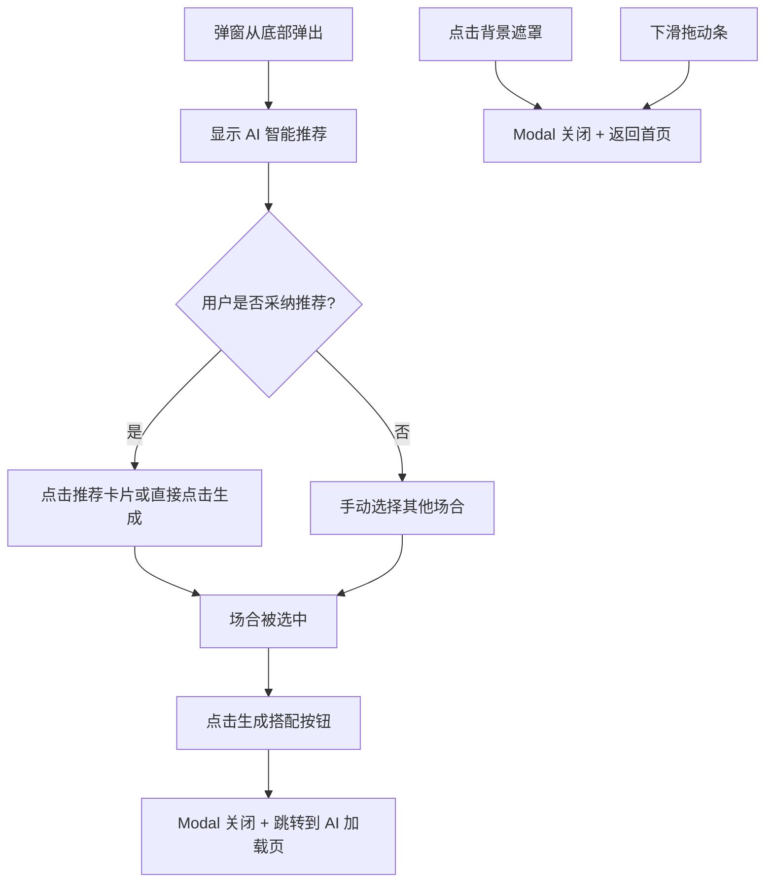

# 场合选择弹窗页

**页面标识:** `OccasionSelectorModal`
**导航路径:** 首页 → 拍照/选择照片 → 场合选择弹窗
**设计版本:** v1.0 - Modal 弹窗形式
**最后更新:** 2025-12-31

---

## 页面概述

### 页面目标
- **主要目标**: 让用户快速选择今天的穿搭场合，提升 AI 推荐精准度
- **次要目标**: 通过 AI 智能推荐减少用户决策成本
- **情感目标**: 传递"懂你的场景"智能感，建立信任

### 用户任务
1. **主任务**: 选择今天的穿搭场合（单选）
2. **次任务**: 查看 AI 智能推荐的场合
3. **支持任务**: 确认选择并进入生成流程

### 成功标准
- 用户在 5 秒内完成场合选择
- AI 推荐采纳率 > 60%
- 点击"生成搭配"按钮转化率 > 90%

---

## 设计方向

**Modal 弹窗设计**

**核心视觉特征:**
- 半屏弹窗从底部弹出（Bottom Sheet）
- 白色背景卡片 + 圆角 24px
- 紫色品牌色用于选中状态（`#6C63FF`）
- 毛玻璃背景遮罩（`rgba(0,0,0,0.4)`）

---

## 布局结构

### 页面区域划分

```
┌─────────────────────────────────┐
│  [背景遮罩 - 半透明黑]            │
│                                 │
│  ┌─────────────────────────────┐│
│  │ [拖动条]                    ││ 5px
│  │─────────────────────────────││
│  │ [Modal 标题]                ││
│  │ "选择搭配场合"              ││ 60px
│  │ "告诉我你今天要去哪里..."    ││
│  │─────────────────────────────││
│  │ [AI 智能推荐卡片]           ││
│  │ ⚡ AI 智能推荐             ││ ~72px
│  │ 职场通勤                    ││
│  │ 工作日 · 9:00 AM           ││
│  │─────────────────────────────││
│  │ [场合网格]                  ││
│  │ ┌─────┬─────┬─────┐        ││
│  │ │ 💼  │ 💕  │ ☕  │        ││
│  │ │通勤 │约会 │休闲 │        ││ ~320px
│  │ ├─────┼─────┼─────┤        ││
│  │ │ 🎉  │ 🏃  │ 🏠  │        ││
│  │ │聚会 │运动 │居家 │        ││
│  │ └─────┴─────┴─────┘        ││
│  │─────────────────────────────││
│  │ [生成搭配按钮]              ││ 52px
│  └─────────────────────────────┘│
│  [Home Indicator]               │ 34px
└─────────────────────────────────┘
```

---

## 组件清单

### 1. 背景遮罩 (Backdrop)

**组件:** `ModalBackdrop`

**样式:**
- 背景：`rgba(0, 0, 0, 0.4)` 半透明黑
- 点击关闭 Modal
- 支持手势下滑关闭

---

### 2. 拖动条 (Drag Indicator)

**组件:** `DragIndicator`

**样式:**
- 尺寸：36×5px
- 颜色：`#D1D1D6` 浅灰
- 圆角：3px
- 居中显示

**交互:**
- 视觉指示器，提示用户可以下滑关闭

---

### 3. Modal 标题区域 (Header)

**组件:** `ModalHeader`

**内容:**
- **主标题**: "选择搭配场合"
  - 字号：24pt Bold
  - 颜色：黑色 `#1C1C1E`
  - Letter-spacing: -0.5px

- **副标题**: "告诉我你今天要去哪里，AI 会为你推荐更合适的搭配"
  - 字号：15pt Regular
  - 颜色：灰色 `#8E8E93`
  - 行高：1.4

---

### 4. AI 智能推荐卡片 (Smart Recommend)

**组件:** `SmartRecommendCard`

**样式:**
- 背景：紫色渐变 `linear-gradient(135deg, #F0EFFF 0%, #E8E6FF 100%)`
- 边框：2px solid `#6C63FF`
- 圆角：12px
- 内边距：12px 16px

**内容:**
- **图标**：左侧闪电图标
  - 尺寸：32×32px
  - 背景：紫色圆形 `#6C63FF`
  - 图标颜色：白色

- **推荐标签**: "AI 智能推荐"
  - 字号：12pt Semibold
  - 颜色：紫色 `#6C63FF`

- **推荐场合**: "职场通勤"
  - 字号：15pt Semibold
  - 颜色：黑色 `#1C1C1E`

- **推荐原因**: "工作日 · 9:00 AM · 适合办公场景"
  - 字号：12pt Regular
  - 颜色：灰色 `#8E8E93`

**逻辑:**
- 基于当前时间、日期、用户历史数据智能推荐
- 工作日 7:00-9:00 推荐"职场通勤"
- 周末推荐"休闲娱乐"或"约会"
- 晚上 18:00+ 推荐"聚会派对"

---

### 5. 场合网格 (Occasions Grid)

**组件:** `OccasionsGrid`

**布局:**
- 3列网格布局
- Gap: 12px
- 每个卡片宽高比 1:1

**场合卡片 (Occasion Card):**

**内容:**
- **图标**: Emoji 图标（32px）
  - 💼 职场通勤
  - 💕 浪漫约会
  - ☕ 休闲娱乐
  - 🎉 聚会派对
  - 🏃 运动健身
  - 🏠 居家休闲

- **标签**: 场合名称
  - 字号：14pt Semibold
  - 颜色：黑色 `#1C1C1E`

**状态:**
- **默认状态**:
  - 背景：`#F9F9F9` 浅灰
  - 边框：2px transparent

- **选中状态**:
  - 背景：紫色渐变 `linear-gradient(135deg, #F0EFFF 0%, #E8E6FF 100%)`
  - 边框：2px solid `#6C63FF`
  - 标签颜色：紫色 `#6C63FF`

**交互:**
- 单选模式
- 点击时切换选中状态
- Active 状态：缩放 0.95
- Haptic Feedback: Medium

---

### 6. 生成搭配按钮 (Confirm Button)

**组件:** `ConfirmButton`

**样式:**
- 宽度：100% 减去边距
- 高度：52px
- 背景：紫色渐变 `linear-gradient(135deg, #6C63FF 0%, #7B72FF 100%)`
- 圆角：12px
- 阴影：`0 4px 12px rgba(108, 99, 255, 0.3)`

**文字:**
- 内容："生成搭配"
- 字号：17pt Semibold
- 颜色：白色

**交互:**
- Active 状态：缩放 0.98
- 点击后跳转到 AI 加载页
- Haptic Feedback: Medium

**状态:**
- 默认可用（必须选择一个场合）
- 未选择场合时禁用（背景变灰）

---

## 交互规范

### 核心交互流程



### 手势交互

| 手势 | 触发区域 | 响应 |
|------|---------|------|
| 点击 | 场合卡片 | 选中该场合 + Haptic (Medium) |
| 点击 | 生成搭配按钮 | 关闭 Modal + 跳转加载页 + Haptic (Medium) |
| 点击 | 背景遮罩 | 关闭 Modal + 返回首页 |
| 下滑 | 拖动条或 Modal 顶部 | 关闭 Modal + 返回首页 |

---

## 动画规范

### 弹窗进入动画
- 从底部滑入
- 持续时间：300ms
- Easing: `cubic-bezier(0.4, 0, 0.2, 1)`
- 背景遮罩渐显：200ms

### 弹窗退出动画
- 滑出到底部
- 持续时间：250ms
- Easing: `cubic-bezier(0.4, 0, 1, 1)`
- 背景遮罩渐隐：200ms

### 卡片选中动画
- 背景颜色过渡：200ms
- 边框颜色过渡：200ms
- Active 缩放：100ms `ease-out`

---

## 数据需求

### 需要从后端/本地获取的数据

**1. AI 推荐数据**
```typescript
{
  recommendedOccasion: string;     // "职场通勤"
  reason: string;                  // "工作日 · 9:00 AM · 适合办公场景"
  confidence: number;              // 0.0-1.0 推荐置信度
}
```

**2. 场合列表**
```typescript
{
  id: string;
  name: string;                    // "职场通勤"
  icon: string;                    // "💼"
  keywords: string[];              // ["正式", "商务", "办公"]
}[]
```

### AI 推荐逻辑

**时间规则:**
- 工作日 7:00-9:00 → 职场通勤
- 工作日 18:00-22:00 → 聚会派对 / 休闲娱乐
- 周末白天 → 休闲娱乐 / 约会
- 运动时段（早晨/傍晚） → 运动健身

**用户历史:**
- 分析用户最常选择的场合
- 上次选择的场合权重提升

---

## 无障碍支持

### VoiceOver 标签

| 元素 | accessibilityLabel | accessibilityHint |
|------|-------------------|-------------------|
| 场合卡片 | "{场合名称}，场合选项" | "选择此场合进行搭配推荐" |
| AI 推荐卡片 | "AI 推荐：{场合名称}" | "基于当前时间和场景的智能推荐" |
| 生成搭配按钮 | "生成搭配" | "确认选择并生成搭配方案" |
| 拖动条 | "拖动关闭" | "向下滑动关闭弹窗" |

### 触摸目标尺寸
- 场合卡片：最小 80×80px
- 生成搭配按钮：52px 高度
- 所有按钮 ≥ 44×44pt

---

## 技术实现注意事项

### React Native 组件结构

```typescript
<Modal
  visible={isVisible}
  transparent
  animationType="slide"
>
  <Pressable style={styles.backdrop} onPress={onClose}>
    <View style={styles.modalContent}>
      <DragIndicator />

      <ModalHeader
        title="选择搭配场合"
        subtitle="告诉我你今天要去哪里..."
      />

      <SmartRecommendCard
        occasion={recommendedOccasion}
        reason={reason}
        onPress={handleRecommendSelect}
      />

      <OccasionsGrid
        occasions={occasions}
        selectedId={selectedOccasionId}
        onSelect={handleOccasionSelect}
      />

      <ConfirmButton
        disabled={!selectedOccasionId}
        onPress={handleConfirm}
      />
    </View>
  </Pressable>
</Modal>
```

### 手势处理
```typescript
import { GestureDetector, Gesture } from 'react-native-gesture-handler';

const panGesture = Gesture.Pan()
  .onUpdate((event) => {
    if (event.translationY > 0) {
      // 下滑动画
    }
  })
  .onEnd((event) => {
    if (event.translationY > 100) {
      onClose(); // 关闭 Modal
    }
  });
```

---

## 原型文件

**可交互原型:** `occasion-selector.html`

---

## 更新日志

| 版本 | 日期 | 更新内容 |
|-----|------|---------|
| v1.0 | 2025-12-31 | 初版：Bottom Sheet 弹窗设计 + AI 智能推荐 |
