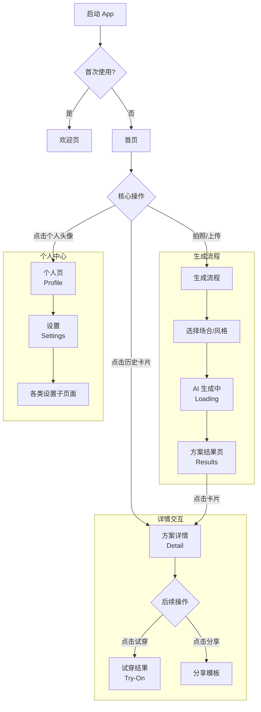

# 搭理 App - UX 设计页面索引

**设计版本:** v1.1
**最后更新:** 2026-01-04

---

## 📱 页面结构总览

本目录包含搭理 App 的所有 UX 设计页面，每个页面包含：
- **MD 文档**: 详细的设计规范（布局、组件、交互、动画）
- **HTML 原型**: 可交互的高保真原型（iPhone 15 Pro 尺寸：393×852px）

重要更新 (v1.1):
- 全线升级 **Purple Mesh Gradient** (极光紫) 视觉语言。
- 引入 **Concave Header** (反向圆角) 和 **Floating Cards** (悬浮卡片) 布局。
- 新增 **设置中心** 及其子页面群。
- 新增 **虚拟试穿** 结果页。

---

## 🗂️ 页面清单

### 核心功能 (Core Feature Pages)

| 页面 | 标识 | 文档 | 原型 | 说明 |
|------|------|------|------|------|
| **欢迎页** | WelcomeScreen | [📄](06-welcome-onboarding/welcome-onboarding-page.md) | [🔗](06-welcome-onboarding/welcome-onboarding-page.html) | 首次启动引导页 |
| **首页** | HomeScreen | [📄](01-home/home-page.md) | [🔗](01-home/home-page.html) | 核心入口：拍照/相册 + 历史记录 |
| **首页空状态** | HomeEmptyState | 见首页文档 | [🔗](01-home/home-page-empty.html) | 无历史记录的空状态 |
| **搭配列表 (原衣橱)** | OutfitListScreen | [📄](04-wardrobe/wardrobe-page.md) | [🔗](04-wardrobe/outfit-page.html) | *Renamed*: 历史搭配记录 + 搜索/筛选 |
| **个人页** | ProfileScreen | [📄](05-profile/profile-page.md) | [🔗](05-profile/profile-page.html) | 用户资料 + AI 学习进度 |

### 搭配生成流程 (Generation Service Pages)

| 页面 | 标识 | 文档 | 原型 | 说明 |
|------|------|------|------|------|
| **场合选择弹窗** | OccasionSelectorModal | [📄](07-flow-pages/occasion-selector.md) | [🔗](07-flow-pages/occasion-selector.html) | Bottom Sheet：选择穿搭场合 + AI 推荐 |
| **拍照+场合选择** | PhotoOccasionScreen | [📄](07-flow-pages/photo-occasion.md) | [🔗](07-flow-pages/photo-occasion.html) | 照片预览 + 场合/风格选择 |
| **AI 生成中** | AILoadingScreen | [📄](07-flow-pages/ai-loading.md) | [🔗](07-flow-pages/ai-loading.html) | *Visual Updated*: 紫色极光背景 + 呼吸动画 |
| **搭配方案结果** | OutfitResultsScreen | [📄](02-outfit-results/outfit-results-page.md) | [🔗](02-outfit-results/outfit-results-page.html) | *Visual Updated*: 显示 3 个 AI 生成的搭配方案 |
| **方案详情** | OutfitDetailScreen | [📄](03-outfit-detail/outfit-detail-page.md) | [🔗](03-outfit-detail/outfit-detail-page.html) | *Visual Updated*: 悬浮卡片布局 + 详情展示 |
| **虚拟试穿结果** | TryOnResultScreen | (待补充) | [🔗](09-try-on/try-on-result.html) | *New*: AI 试穿效果预览 + 玻璃质感操作栏 |

### 设置中心 (Settings Pages)

| 页面 | 标识 | 文档 | 原型 | 说明 |
|------|------|------|------|------|
| **设置首页** | SettingsScreen | (见 Profile) | [🔗](05-profile/settings-page.html) | 设置项入口聚合 |
| **账号安全** | SettingsSecurity | - | [🔗](05-profile/settings-security.html) | 修改密码、绑定手机 |
| **隐私设置** | SettingsPrivacy | - | [🔗](05-profile/settings-privacy.html) | 权限管理、可见性 |
| **帮助反馈** | SettingsHelp | - | [🔗](05-profile/settings-help.html) | 常见问题、问题反馈 |
| **关于我们** | SettingsAbout | - | [🔗](05-profile/settings-about.html) | 版本信息、用户协议 |

### 分享功能 (Share Feature)

| 页面 | 标识 | 文档 | 原型 | 说明 |
|------|------|------|------|------|
| **分享模板** | ShareTemplatesModal | [📄](08-share/share-templates.md) | [🔗](08-share/share-templates.html) | 选择分享模板 + 多平台分享 |

---

## 🔄 核心用户流程 (Updated)

---

## 📐 设计规范 (v1.1)

### 视觉特征 (Visual Identity)
- **Mesh Gradient (极光紫)**: 用于所有 Loading 页、Header 背景、强调区域。
  - CSS: `radial-gradient` 组合 (`#8B7FFF`, `#6C63FF`, `#5D55E6`)
- **Concave Header (反向圆角)**: 头部与内容区的连接处使用 `border-radius: 32px 32px 0 0` 的反向遮罩，创造"内容区向上覆盖"的层次感。
- **Floating Cards (悬浮卡片)**: 内容容器不再通栏，而是圆角卡片 (`radius: 20-24px`) 悬浮于灰色背景之上。
- **Glassmorphism (毛玻璃)**: 用于底部操作栏、Tab Bar、悬浮按钮。

### 颜色系统
- **Primary Purple**: `#6C63FF` (品牌主色)
- **Background Gray**: `#F2F2F7` (iOS System Grayscale 6)
- **Card White**: `#FFFFFF`
- **Text Dark**: `#1C1C1E`
- **Text Light**: `#8E8E93` or `rgba(255,255,255, 0.7)` (on dark bg)

---

## 📊 页面统计

- **总HTML文件数**: 17 个
- **新增页面**: 5 个 (设置子页面 x4, 试穿页 x1)
- **主要更新**: 4 个 (Loading, Results, Detail, Outfit List)

---

## 📝 更新日志

| 版本 | 日期 | 更新内容 |
|-----|------|---------|
| v1.1 | 2026-01-04 | **Visual Polish**: 全线统一紫色极光风格、反向圆角头部；新增设置中心与试穿页。 |
| v1.0 | 2025-12-31 | 初版：基础 11 个页面设计 + 交互原型 |

---

**设计师**: Claude (Antigravity)
**项目**: 搭理 - AI 穿搭顾问
